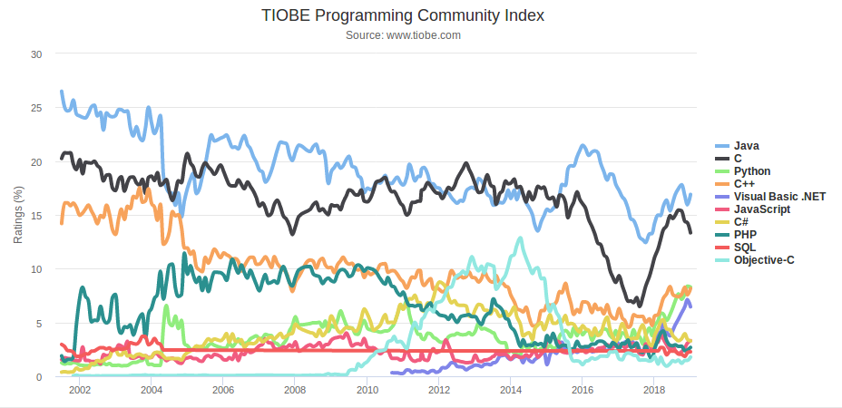
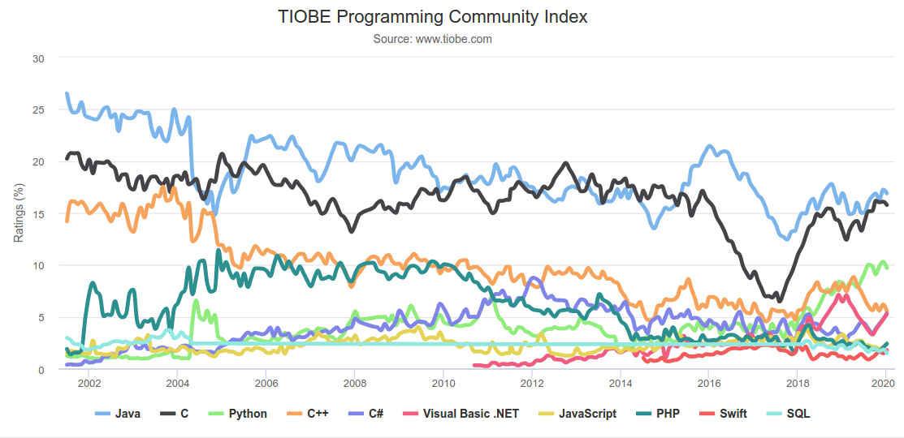
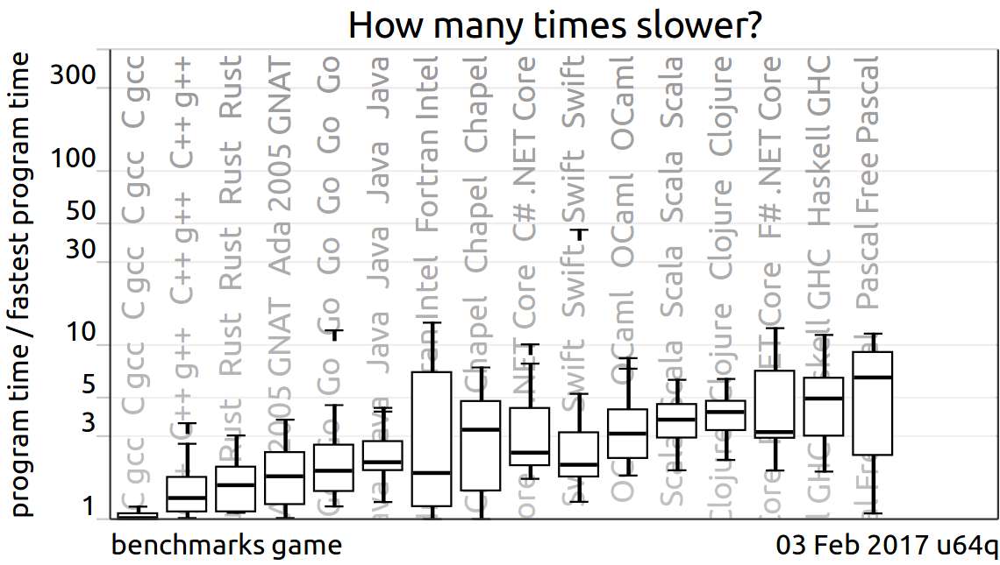

% Presentación de la asignatura
% (manuel.freire@fdi.ucm.es)
% 2023.01.23

## Objetivo

> Presentación de la asignatura
> de Ingeniería Web

# El profesor

- manuel.freire@fdi.ucm.es
- despacho 325
- tutorías 
    + martes de 16 a 17h, y jueves de 10 a 11h
    + *envía un email antes para confirmar, con \[IW] en el subject*
    + en general, flexible en fechas y horas
- tutorías grupales vía *google meet* a demanda

# Contactando con el profesor

- medio preferido: **correo electrónico**: \

    *no envíes mensajes vía Campus Virtual*
- incluye **[IW]** en el título de tu correo

~~~~ {.html}
    <!-- mal -->
    from:    unaCuentaNoUcm@algunsitio.com
    subject: entrega
    ...
~~~~ 

~~~~ {.html}
    <!-- mejor -->
    from:    unaCuentaUcm@ucm.es
    subject: [IW] problemas con entrega 3
    ...
~~~~ 

# La asignatura

- Basic technologies: HTTP, HTML y XML
- Simple servers with Java: Servlets
- Client-side Model-View-Controller, and an
introduction to JS and CSS
- Persistence at the server-side: JPA and databases
- Server-side MVC
- Information exchange with XML and JSON
- The Java web ecosystem

# La asignatura: transcurso

- Conocimientos esperados:
    + Familiaridad con Java, MVC
    + Algo de familiaridad con 
        - tecnologías web y marcado
        - bases de datos

- Asignatura basada en **proyectos**
    + Propuesta + 3 prototipos en grupo
    + Último prototipo usado en examen final individual

# Proyectos

- Entre 4 y 5 integrantes
    + Posible individual, pero requiere *muy* buena excusa
    + Cada grupo desarrolla proyecto de forma iterativa

- Entregas del proyecto: 40%
    + entregas intermedias obligatorias, pero *no cuentan para nota*
    + entrega final cuenta 40%

- Examen final: 60%
    + requiere entrega final aprobada
    + **individual** y **en laboratorio**; específico para cada grupo
    + consiste en pequeños cambios sobre el código de tu proyecto

# Por semanas

1. presentación
2. introducción al entorno; creación de grupos, y **Entrega** de propuestas de proyecto
3. HTML & CSS; *negociación de propuestas*
4. Servidores sencillos con Spring MVC + Thymeleaf, sesiones & cookies
5. MVC cliente, con HTML, CSS & JS. **Entregas** del 1er prototipo (sin BD), y de los esquemas de BD.
6. JPA y uso de BD desde Spring MVC. *1er prototipo y esquema corregidos*
7. MVC servidor; subida y bajada de ficheros, seguridad & Spring
Security.
8. Intercambio de información con XML y JSON, uso de AJAX; WebSockets.
9. JS avanzado; Pruebas en aplicaciones web. Último día en aula de teoría.
10. tutorías en laboratorio; **Entrega** del 2º prototipo (con BD)
11. y posteriores: tutorías en laboratorio, con **Entrega final** el último día

- examen final: individual, *correcciones de la entrega final*
- 1 semana después: **entrega versión revisada** \

    (con mejoras solicitadas en el examen)
- 1 semana después: notas

# Transcurso típico de 1 semana

## Hasta la semana 9: teoría y proyecto

+ El **lunes**, introducimos temas nuevos de teoría
    - varios bloques de teoría
    - pausa tras cada bloque para plantear preguntas de autoevaluación
+ El **martes**, hacemos un ejercicio corto sobre lo del lunes, y avanzamos proyecto

## A partir de la semana 10: sólo proyecto

+ Todas las clases son prácticas, para avanzar el proyecto.
+ Tutorías grupales para avanzar en proyectos
+ Nuevos temas sólo "a demanda"

# Comparación con Aplicaciones Web

AW

+ Usa XAMP como pila tecnológica: Apache, PHP, MySQL: 3 servidores
+ Pila de más bajo nivel (PHP viene sin *enrutador* ni noción de seguridad)
+ Nota por proyectos + porcentajes participación
+ Más guiada
+ No menciona leguajes de *templates*
+ No incorpora *websockets*

IW

+ Usa Java + Spring MVC como pila; instalación fácil (si tienes JVM)
+ Pila de más alto nivel (Spring MVC, Spring Security, Maven)
+ Nota por proyectos + examen individual sobre el mismo
+ Más libre
+ MVC más claro, Thymeleaf como lenguaje de templates dedicado
+ WebSockets obligatorios

# El mundo web

{ height=90% }

# Frontend

+ Modelo: HTML mínimo
    - DOM
    - elementos
    - eventos
+ Vista: CSS mínimo 
    - aplicando estilos a elementos sencillos
    - algo del modelo de contenedores y layout
    - admisible usar Bootstrap 4 para conseguir diseño "responsive"
+ Controlador: JS mínimo:
    - asociando eventos a nodos DOM
    - validación de formularios 
    - algo de AJAX
    - un poquito de cosa asíncrona con WebSockets

(muy similar a lo visto en AW - \

*y al igual que en AW, no es el principal objetivo de la asignatura*)
    
# Backend

+ Modelo Java con JPA, H2
    - Mapeo objeto-relación automágico
    - En general, mucho más cómodo que MySQL
+ Vista: Thymeleaf
    - Uso de Thymeleaf, un motor de templates moderno
    - equivalentes: mustache, underscore, ...
+ Controlador: Java con Spring MVC, Spring Security
    - Fácil enrutar a vistas,
    - gestionar seguridad
    - y manejar eventos en tiempo real via WebSockets

(Mayor nivel de abstracción permite hacer aplicaciones 
más complejas y ricas que las de AW *y se espera que las hagais*)
    
# DevOps

+ Git/github: gestión de versiones
    + y se usará para ir actualizando la plantilla 
    + y para hacer ocasionales *pull request*
+ Maven: gestión de dependencias
    + permite importar proyecto en distintos IDEs
    + permite despliegues, pruebas, distribuciones desde consola
    + miles de librerías al alcance de vuestra aplicación
+ Contenedor Docker FDI
    + entorno de referencia para ejecución de las prácticas
    + ideal para ir poblando la BD / colaborar

# Entregas

* .zip por Campus Virtual, y enlace a commit en github / bitbucket / equivalente. 
* contenido especificado en tarea de entrega, proyecto plantilla
* prototipos 1 y 2 no cuentan para nota (pero son obligatorios)
* entrega final:
    - nota base del grupo (si sacas un 10 en el examen, te quedas con esa nota)
    - examen individual pide modificarlo
* entrega revisada: correcciones post-examen

# Java vs otros lenguajes

{ width=100% }

 - - -

{ width=100% }

 - - - 

{ width=100% }

# Tecnologías según SO dev survey

{ width=80% }

 - - - 

{ width=80% }

 - - - 

{ width=80% }

 - - - 

{ width=80% }

 - - - 

{ width=80% }

# Comparando lenguajes de programación

{ height=50% }

Lenguaje *X* mejor que *Y*...

- ¿Para qué problema? ¿con qué entradas? ¿en qué máquina?
- ¿Y cuánto te costó escribirlo? ¿se entiende luego?
- ¿Y cuánto consume de memoria? ¿cómo de bien escala luego?
- ...

# Java vs PHP

- Mucho más elegante/puro como lenguaje
- Mucho mejor manejo de errores
- Tipado estricto + compilación detecta muchos problemas pre-ejecución
- Mejor ecosistema (Maven, JUnit, ...)
- Buenos IDEs (IntelliJ IDEA, Eclipse/STS, NetBeans)
- Popular también fuera del ámbito de servidor web

# Algunos proyectos viejos ('17-18)

- glorysaloon: juega al blackjack y otros **juegos de cartas** con tus colegas. Incluye analíticas para ayudarte a mejorar.
- tusnoticias: selecciona **recortes de noticias** de los periódicos para comentarlos con otros usuarios
- fixit: arregla tus cacharros rotos contactando con nuestros técnicos, que te informarán de todos los pasos de la **reparación de dispositivos**
- gameon: queda con tus amigos para competir online usando tus videojuegos favoritos contra otros clanes. **Administra tu clan** y tus próximos retos
- usports: **deportes universitarios**, especializados en la UCM. Administra un equipo, incluyendo parrillas, informes post-partido, galería de fotos, ...
- linkednow: portal para gestionar **prácticas en empresa** de alumnos. Perfiles para alumnos, personal de universidad, y empresas, cada uno con sus tareas
- tamaa: anuncia, comenta e **intercambia objetos** que ya no necesitas con otros tamaaeros. 

# Algunos proyectos viejos ('18-19)

- bookworms: recomienda **libros**, y préstate ejemplares en papel con gente de gusto tan bueno como el tuyo.
- masacre: juego multijugador de **cartas** basado en el clásico *mafia* ó *hombre lobo*. 
- interpet: tu **mascota** siempre bien cuidada, gracias a esta página que pone en contacto dueños con paseadores, peluqueros, etcétera.
- gastronomo: web de creación y gestión de **webs para restaurantes**
- socialgames: tute **(juego de cartas)** online y multijugador.
- firefighterspace: gestión online para **bomberos**, con distintos roles, gestión de inventario, horarios, guardias, etcétera.
- m3: tus **archivos en la nube**, siempre bien clasificados y fáciles de compartir con tus amigos; además de incluir un reproductor incorporado para verlos o escucharlos.

# Algunos proyectos viejos ('19-20)

- almagym: gestión integral de un **gimnasio**, permitiendo apuntarse a actividades, compartir fotos, gestionar espacios y material, etcétera.
- influencing: portal para que empresas contacten con **influencers** para sus campañas de publicidad, con mecanismos para negociar contratos y hacer su seguimiento.
- matchgo: un portal para montar y gestionar **actividades** en grupo: apúntate a actividades que se están montando, o monta tú las tuyas.
- physionet: gestiona tu gabinete de **fisioterapia** online, con puntos de entrada tanto para los especialistas como para los usuarios del servicio.
- ucmh: seguimiento de **salud mental** online para personal y alumnos de la UCM
- multigym: alquila o reserva **espacios deportivos** online acorde con tus necesidades y posibilidades

# Un buen proyecto

- **no existe** ya (más foros no, gracias)
- hace uso de las **tecnologías vistas en clase**
    
    + WebSockets permiten notificaciones en tiempo real - ¡úsalos!

- no es **ni muy simple ni muy complejo** \

    orientativo: unas 6 vistas / tablas en la BD (login / usuario inclusive)
- es **útil** para alguien

# Fin

## ¿dudas?

{ width=25% }

This work is licensed under a [Creative Commons Attribution-ShareAlike 4.0 International License](https://creativecommons.org/licenses/by-sa/4.0/)

