% Introducción a las tecnologías web
% (manuel.freire@fdi.ucm.es)
% 2023.01.23

## Objetivo y contenido

> Reflexionar un poco sobre la historia \
> y el estado actual de las \
> tecnologías web

- Internet: del '69 hasta ahora
- Enrutamiento de paquetes
- Conexiones sobre paquetes: TCP
- Transfiriendo páginas web: HTTP
- Aplicaciones web: del '96 hasta ahora

# Internet: del '69 hasta ahora

## Correo vs Teléfono

### Correo "Wells Fargo"
- mensajes en sobres con remitente y destinatario
- en cada salto, el cartero decide cómo llegar a la siguiente ciudad
- si cortan una carretera, pero queda al menos una ruta abierta, el mensaje no tiene porqué perderse
- distintos mensajes pueden llegar fuera de orden, o alguno puede perderse

### Teléfono clásico
- conexiones se establecen de punto a punto
- fase de establecimiento de la conexión \
  marcado -> establecimiento-> sonando en receptor -> ya puedes hablar

- una vez establecida, uso exclusivo del canal hasta que se termine
- todo llega en el orden que se envió (o no llega en absoluto)
- si se rompe un nodo, se pierden todas sus conexiones activas

## 1969. Guerra fría

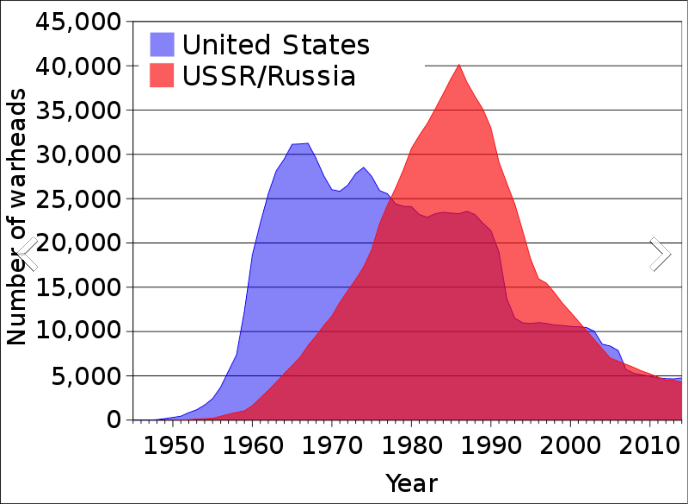{ height=70% }

## de ARPANET a Internet

- Advanced Research Projects Agency (actual DARPA)
- Surge de intentos para montar redes robustas y reconfigurables,\
  en parte por miedo a guerra nuclear
- '70: primer enlace costa-a-costa (de EEUU)
- '71: 23 nodos (entre universidades y otros centros)
- '74: Internetwork Protocol (ver [RFC 675](https://tools.ietf.org/html/rfc675)); 46 nodos

## 1974: ARPANET

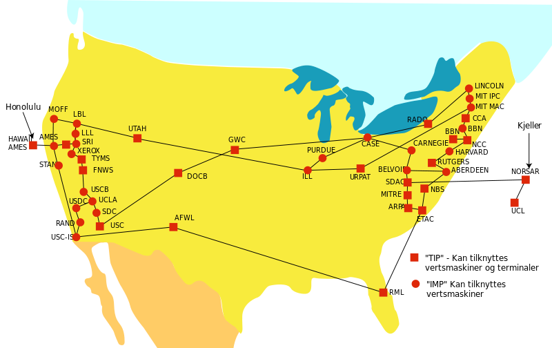{ height=90% }

## de ARPANET a Internet, parte 2

- Advanced Research Projects Agency (actual DARPA)
- Surge de intentos para montar redes robustas y reconfigurables,\
  en parte por miedo a guerra nuclear
- '70: primer enlace costa-a-costa (de EEUU)
- '71: 23 nodos (entre universidades y otros centros)
- '74: Internetwork Protocol (ver [RFC 675](https://tools.ietf.org/html/rfc675)); 46 nodos
- '75: considerada "operativa"; 57 nodos
- '81: unos 213, con nuevos nodos cada menos de 1 mes. IPv4 [RFC 791](https://tools.ietf.org/html/rfc791)
- '84: CERN (Conseil européen pour la recherche nucléaire) empieza a usar TCP/IP para enlazar sus centros. RIPE (Réseaux IP Européens)
- '86: IETF fundada
- '92: Internet Society
- '93: NCSA Mosaic

## Pila de protocolos en el '81

~~~
    +------+ +-----+ +-----+     +-----+
    |Telnet| | FTP | | TFTP| ... | ... |
    +------+ +-----+ +-----+     +-----+
          |   |         |           |
        +-----+     +-----+     +-----+
        | TCP |     | UDP | ... | ... |
        +-----+     +-----+     +-----+
            |           |           |
        +--------------------------+----+
        |    Internet Protocol & ICMP   |
        +--------------------------+----+
                        |
          +---------------------------+
          |   Local Network Protocol  |
          +---------------------------+
~~~
Figura 1 de [rfc791](https://tools.ietf.org/html/791)

# Enrutamiento de paquetes

## Enrutamiento de paquetes: la idea

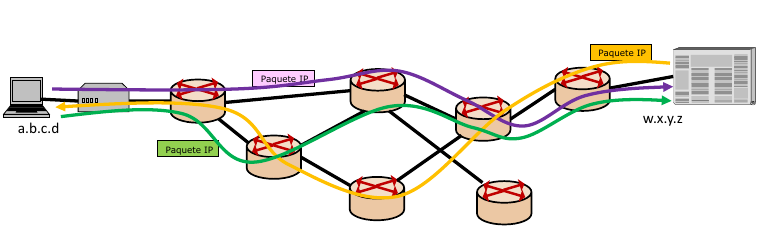{ width=90% }

## Enrutamiento de paquetes: el proceso

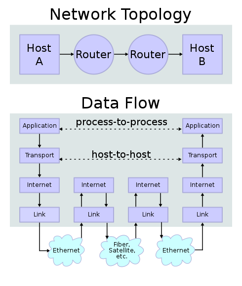{ height=80% }

## Enrutamiento de paquetes: los envoltorios

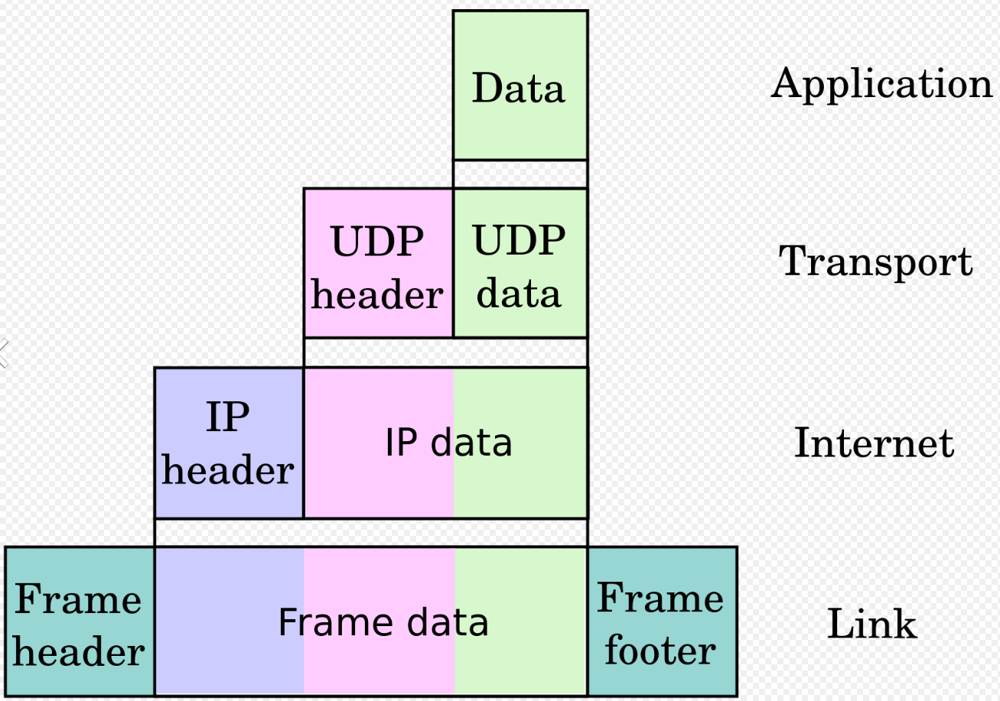{ height=80% }

## El envoltorio IP

~~~
    0                   1                   2                   3   
    0 1 2 3 4 5 6 7 8 9 0 1 2 3 4 5 6 7 8 9 0 1 2 3 4 5 6 7 8 9 0 1 
   +-+-+-+-+-+-+-+-+-+-+-+-+-+-+-+-+-+-+-+-+-+-+-+-+-+-+-+-+-+-+-+-+
   |Version|  IHL  |Type of Service|          Total Length         |
   +-+-+-+-+-+-+-+-+-+-+-+-+-+-+-+-+-+-+-+-+-+-+-+-+-+-+-+-+-+-+-+-+
   |         Identification        |Flags|      Fragment Offset    |
   +-+-+-+-+-+-+-+-+-+-+-+-+-+-+-+-+-+-+-+-+-+-+-+-+-+-+-+-+-+-+-+-+
   |  Time to Live |    Protocol   |         Header Checksum       |
   +-+-+-+-+-+-+-+-+-+-+-+-+-+-+-+-+-+-+-+-+-+-+-+-+-+-+-+-+-+-+-+-+
   |                       Source Address                          |
   +-+-+-+-+-+-+-+-+-+-+-+-+-+-+-+-+-+-+-+-+-+-+-+-+-+-+-+-+-+-+-+-+
   |                    Destination Address                        |
   +-+-+-+-+-+-+-+-+-+-+-+-+-+-+-+-+-+-+-+-+-+-+-+-+-+-+-+-+-+-+-+-+
   |                    Options                    |    Padding    |
   +-+-+-+-+-+-+-+-+-+-+-+-+-+-+-+-+-+-+-+-+-+-+-+-+-+-+-+-+-+-+-+-+
~~~                    
Figura 4 de [rfc2324](https://www.ietf.org/rfc/rfc2324.txt): cabecera IP

# Conexiones sobre paquetes: TCP

## Esquema de TCP

~~~

    0                   1                   2                   3
    0 1 2 3 4 5 6 7 8 9 0 1 2 3 4 5 6 7 8 9 0 1 2 3 4 5 6 7 8 9 0 1
   +-+-+-+-+-+-+-+-+-+-+-+-+-+-+-+-+-+-+-+-+-+-+-+-+-+-+-+-+-+-+-+-+
   |          Source Port          |       Destination Port        |
   +-+-+-+-+-+-+-+-+-+-+-+-+-+-+-+-+-+-+-+-+-+-+-+-+-+-+-+-+-+-+-+-+
   |                        Sequence Number                        |
   +-+-+-+-+-+-+-+-+-+-+-+-+-+-+-+-+-+-+-+-+-+-+-+-+-+-+-+-+-+-+-+-+
   |                    Acknowledgment Number                      |
   +-+-+-+-+-+-+-+-+-+-+-+-+-+-+-+-+-+-+-+-+-+-+-+-+-+-+-+-+-+-+-+-+
   |  Data |           |U|A|P|R|S|F|                               |
   | Offset| Reserved  |R|C|S|S|Y|I|            Window             |
   |       |           |G|K|H|T|N|N|                               |
   +-+-+-+-+-+-+-+-+-+-+-+-+-+-+-+-+-+-+-+-+-+-+-+-+-+-+-+-+-+-+-+-+
   |           Checksum            |         Urgent Pointer        |
   +-+-+-+-+-+-+-+-+-+-+-+-+-+-+-+-+-+-+-+-+-+-+-+-+-+-+-+-+-+-+-+-+
   |                    Options                    |    Padding    |
   +-+-+-+-+-+-+-+-+-+-+-+-+-+-+-+-+-+-+-+-+-+-+-+-+-+-+-+-+-+-+-+-+
   |                             data                              |
   +-+-+-+-+-+-+-+-+-+-+-+-+-+-+-+-+-+-+-+-+-+-+-+-+-+-+-+-+-+-+-+-+

~~~
Figura 3 de [rfc793](https://tools.ietf.org/html/793) ('81): Cabecera TCP

## El precio de una conexión: estados TCP

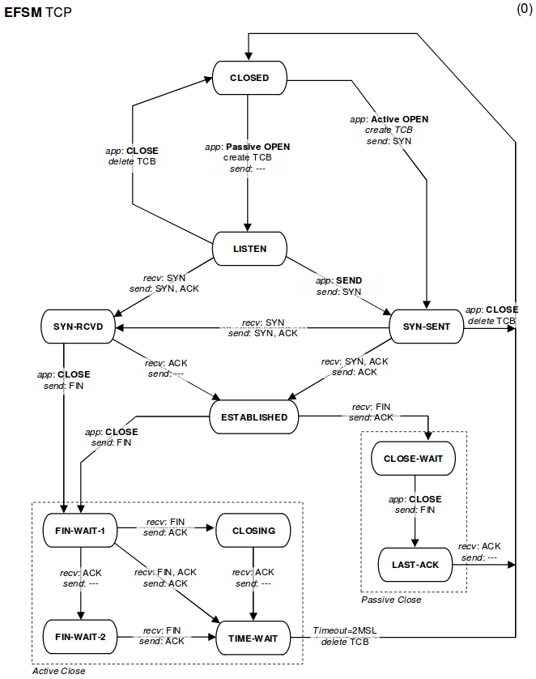{ height=80% }

## El precio de una conexión: apertura

~~~
    TCP A                                                TCP B

1.  CLOSED                                               LISTEN

2.  SYN-SENT    --> <SEQ=100><CTL=SYN>               --> SYN-RECEIVED

3.  ESTABLISHED <-- <SEQ=300><ACK=101><CTL=SYN,ACK>  <-- SYN-RECEIVED

4.  ESTABLISHED --> <SEQ=101><ACK=301><CTL=ACK>       --> ESTABLISHED

5.  ESTABLISHED --> <SEQ=101><ACK=301><CTL=ACK><DATA> --> ESTABLISHED
~~~

Apertura normal: 3 mensajes (*3-way handshake*) en el caso mejor.

## El precio de una conexión: cierre

~~~
    TCP A                                                TCP B

1.  ESTABLISHED                                          ESTABLISHED

2.  (Close)
    FIN-WAIT-1  --> <SEQ=100><ACK=300><CTL=FIN,ACK>  --> CLOSE-WAIT

3.  FIN-WAIT-2  <-- <SEQ=300><ACK=101><CTL=ACK>      <-- CLOSE-WAIT

4.                                                       (Close)
    TIME-WAIT   <-- <SEQ=300><ACK=101><CTL=FIN,ACK>  <-- LAST-ACK

5.  TIME-WAIT   --> <SEQ=101><ACK=301><CTL=ACK>      --> CLOSED

6.  (2 MSL)
    CLOSED
~~~

Cierre normal: 4 mensajes en el caso mejor

## TLS / SSL: añadiendo seguridad

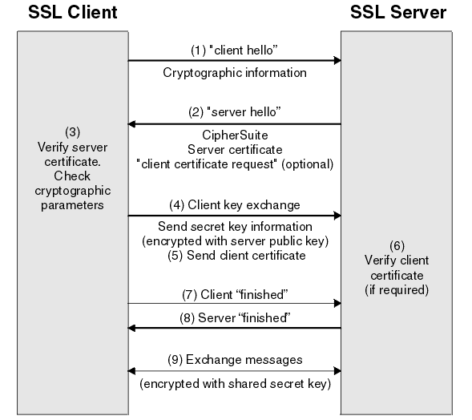{ height=80% }

## Ventajas de TLS

### Sin seguridad

- cualquiera puede leer lo que pasa por el hilo sin que nadie se entere: falta confidencialidad
- y, si puede interrumpir la conexión, cambiarlo por algo distinto: falta integridad

### Con TLS

- sigue siendo posible
  + saber quién habla con quién\footnote{a nivel de IP/puerto, pero sin saber puntos concretos de destino; por ejemplo, Wikipedia, pero no qué página concreta}
  + saber cuándo y (más o menos) cuántas cosas se dicen (pero no qué cosas)
  + si puedes interrumpir la conexión, interrumpirla (duh)
- pero ya no pueden
  + saber qué se dicen (una parte muy importante de *confidencialidad*)
  + cambiar lo que dicen (una parte muy importante de *integridad*)

## Breve historia de TLS / SSL

- SSL1 - incluido en Netscape, por entonces dominante, rápidamente reemplazado
- SSL2: '95 - primera versión publicada
- SSL3: '96 - gran éxito; descrita en [rfc6101](https://tools.ietf.org/html/rfc6101). \
  Completamente insegura desde el 2014
- TLS1.0: '99 - ya bajo dirección del IETF [rfc2246](https://tools.ietf.org/html/rfc2246), incompatible con SSL. Previsto que deje de soportarse en *marzo de 2020*. 
- TLS1.1: '06 - actualización de TLS1; evita algunos ataques\
sigue permitiendo el uso de muchas piezas inseguras \
también previsto fin de soporte de navegador en *marzo de 2020*
- TLS1.2: '08 - evita más ataques, prohibe algunas piezas inseguras
- TLS1.3: '18 - cierra más agujeros, actual. 

## Soporte de distintas versiones

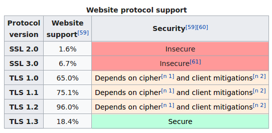{ height=70% }

Datos de la wikipedia en enero de 2020. En general, el estado de la seguridad pone los pelos de punta.

## Coste de TCP + TLS

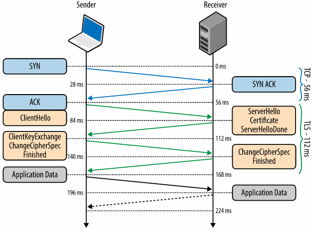{ height=40% }

- Pero hay optimizaciones para empezar a enviar datos después de la 1ª vuelta de TLS, eliminando el retardo de la 2ª vuelta. 
- Buena fuente (usada para ilustración anterior): [Networking 101](https://hpbn.co/transport-layer-security-tls/)

## Certificados y TLS

- certificados necesarios en primer paso para autenticación del servidor. \
Un certificado dice
  * la clave pública del servidor
  * quién dice ser el servidor
  * qué tipo de criptografía usar 
  * qué dominios y propósitos cubre
  * fecha de validez y expiración
- muchos preinstalados en el navegador y/o sistema operativo; a fecha de hoy,
  * [unos 150](https://ccadb-public.secure.force.com/mozilla/IncludedCACertificateReport) "root ACs" en Mozilla \
  FNMT\footnote{recomiendo que os consigais el certificado personal de CERES para administración electrónica} inclusive desde ~2008
  * [unos 299](https://ccadb-public.secure.force.com/microsoft/IncludedCACertificateReportForMSFT) en la lista de Microsoft
- históricamente caros; hoy mismo, en precios $ EEUU del más extendido,
  * un dominio, verificación mínima: ~80 USD/año
  * con subdominios, verificación extendida: ~720 USD/año
- ahora también gratuitos vía [Let's Encrypt](https://letsencrypt.org/)
  * hay que renovarlos cada poco (~30 días)
  * expedición y renovación automatizable vía api/scripts

## Chain of trust

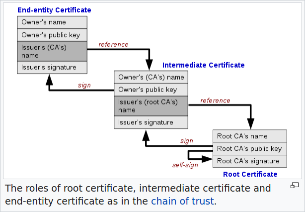{ height=80% }

## Un certificado de ejemplo

\tiny
~~~
Certificate:[15]
    Data:
        Version: 3 (0x2)
        Serial Number:
            04:00:00:00:00:01:15:4b:5a:c3:94
        Signature Algorithm: sha1WithRSAEncryption
        Issuer: C=BE, O=GlobalSign nv-sa, OU=Root CA, CN=GlobalSign Root CA
        Validity
            Not Before: Sep  1 12:00:00 1998 GMT
            Not After : Jan 28 12:00:00 2028 GMT
        Subject: C=BE, O=GlobalSign nv-sa, OU=Root CA, CN=GlobalSign Root CA
        Subject Public Key Info:
            Public Key Algorithm: rsaEncryption
                Public-Key: (2048 bit)
                Modulus:
                    00:da:0e:e6:99:8d:ce:a3:e3:4f:8a:7e:fb:f1:8b:
                    ...
                Exponent: 65537 (0x10001)
        X509v3 extensions:
            X509v3 Key Usage: critical
                Certificate Sign, CRL Sign
            X509v3 Basic Constraints: critical
                CA:TRUE
            X509v3 Subject Key Identifier: 
                60:7B:66:1A:45:0D:97:CA:89:50:2F:7D:04:CD:34:A8:FF:FC:FD:4B
    Signature Algorithm: sha1WithRSAEncryption
         d6:73:e7:7c:4f:76:d0:8d:bf:ec:ba:a2:be:34:c5:28:32:b5:
         ...
~~~
\normalsize

(del artículo de [X.509 de la Wikipedia](https://en.wikipedia.org/wiki/X.509#Structure_of_a_certificate))

# Transfiriendo páginas web: HTTP

## Breve historia del protocolos

- 1991 - primeros pasos
- 1996 - http 1.0 - internet a lomos de la www, guerra de navegadores
- 1997 - http 1.1 - éxito increíble de la web; http+tls = https
- 2015 - http 2.0 - compresión de cabeceras, flujos paralelos; \
  muy transparente para usuarios de web, incluso desarrolladores
- 2018 - http 3.0 - uso de UDP para controlar congestión

## HTTP 1.0

* definido en [rfc1945](https://tools.ietf.org/html/rfc1945) ('95)
* describe URIs y URLs
  - el propio RFC dice que no hay acuerdo sobre qué significan las siglas
  - *algo que sirve para identificar un recurso en la red*
* formatos de *fecha*, de codificación de *caracteres*, de archivos (*mime*)
* tipos de mensajes HTTP
  * peticiones
      - tipo: GET, HEAD, POST
      - y sus cabeceras
  * respuestas
      - 1xx - informativo
      - 2xx - éxito
      - 3xx - éxito parcial, vuelve a intentarlo
      - 4xx - problema en cliente
      - 5xx - problema en servidor

## Respuestas HTTP: greatest hits

* 2xx
  - 200 Ok
* 3xx
  - 301 Moved Permanently - (y adjunta nueva dirección)
  - 302 Found - (y adjunta nueva dirección): \
    cambio temporal de sitio, puedes seguir usando dirección vieja
* 4xx 
  - 400 Bad Request - no entiendo la petición
  - 401 Unauthorized - no sé quién eres
  - 403 Forbidden - sé quién eres, pero no estás en mi lista
  - 404 Not found
* 5xx
  - 500 Internal Server Error - algo feo ha pasado, y no te puedo decir qué es
  - 502 Bad Gateway - mi colega, que es quien lleva ésto, no me responde

(una buena lista en la [MDN](https://developer.mozilla.org/en-US/docs/Web/HTTP/Status), versiones alternativas en [múltiples](https://http.cat/) [sitios](https://www.ietf.org/rfc/rfc2324.txt) )
  
## Apartado de seguridad en el RFC de HTTP1.0
      
* Autenticación de clientes - soportaban sólo autenticación a nivel de usuario/contraseña, con cookie dedicada
* Métodos seguros e inseguros - estandarizaban POST para operaciones no-idempotentes
* Abuso de logs del servidor - dejaban claro que la información sobre hábitos de navegación debería protegerse frente a terceros, por ser sensible
* Uso de cabeceras `server`, `referer`, y `from`
* Abuso de rutas (enlace [OWASP](https://owasp.org/www-community/attacks/Path_Traversal))

## HTTP 1.1

- más peticiones
  * GET, HEAD, POST
  * PUT, DELETE
  * TRACE, OPTIONS
  * CONNECT 
- más cabeceras
  * conexiones persitentes
  * control de cache
  * cookies
  * ...

## Ejemplos

según la página sobre [http en la wikipedia](https://en.wikipedia.org/wiki/Hypertext_Transfer_Protocol) - sorprendentemente, no incluye cookies

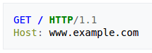{ width=20% }
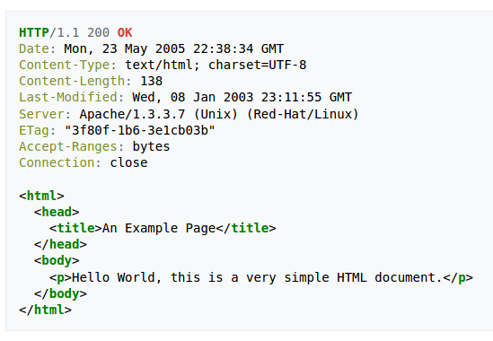{ height=70% }

## Refinamientos sobre HTTP 1.1

* Protocolo extremadamente usado, conocido, y longevo: ¡23 años y contando!
* [rfc2616](https://tools.ietf.org/html/rfc2616) dividido en 6 partes en 2014 (rfc7230 a rfc7235): 

~~~
RFC 7230, HTTP/1.1: Message Syntax and Routing
RFC 7231, HTTP/1.1: Semantics and Content
RFC 7232, HTTP/1.1: Conditional Requests
RFC 7233, HTTP/1.1: Range Requests
RFC 7234, HTTP/1.1: Caching
RFC 7235, HTTP/1.1: Authentication
~~~

* División permite actualizar partes por separado
* 2011 - se incorporan los **websockets**, que comparten puerto pero *no* son HTTP. 
  - Mecanismo: cabecera "upgrade" para reutilizar una conexión establecida y convertirla en WebSocket

## HTTP 2

* Basado sobre SPDY, una iniciativa de Google para acelerar la carga de páginas
* Dos partes
  - [rfc7540](https://tools.ietf.org/html/rfc7540) describe el protocolo
  - [rfc7541](https://tools.ietf.org/html/rfc7541) se centra en la compresión de cabeceras http
* Protocolo supone reingeniería de cómo se envían peticiones/respuestas HTTP, sin tocar su contenido
  - frames:
      * HEADERS
      * DATA
      * SETTINGS
      * WINDOW_UPDATE
      * PUSH_PROMISE
  - posible multiplexar frames, para evitar cuellos de botella

## Adopción de HTTP 2

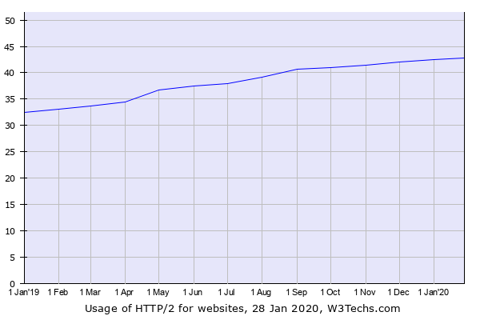{ width=40% }
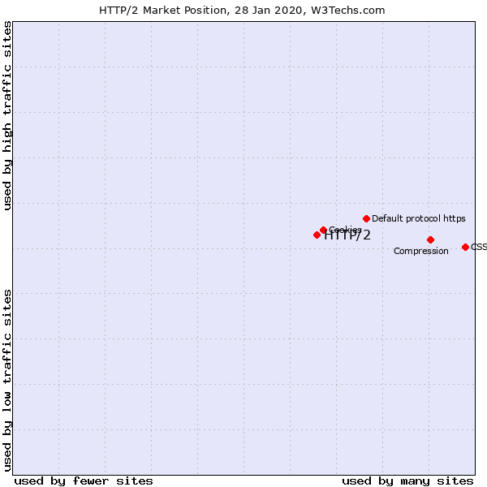{ width=40% }

* según [w3techs](https://w3techs.com/technologies/details/ce-http2)
* Casi tan popular como las cookies, que ya es decir
* Interesante comparar con datos [de cuando se introdujo](https://blog.cloudflare.com/cloudflares-impact-on-the-http-2-universe/)
  
## HTTP 3

* Basado sobre QUIC, otra iniciativa de Google
* Usa UDP para control de contención, evitando atascos
* En [borrador](https://quicwg.org/base-drafts/draft-ietf-quic-http.html); soporte experimental
  - chrome desde dicimenbre 2019
  - firefox desde enero 2020

# Aplicaciones web: del '96 hasta ahora

## Breve historia

- '93: primeros CGIs, comienzan a estandarizarse en el '97, \
rfc3875 en el '04; mucho Perl, e incluso C/C++
- '96: otros lenguajes\
    ASP, PHP, JSPs + Servlet 2.0 en Java
- '99: idea de usar XMLHttpRequest, predecesor de Ajax; .war
- '00: primeros frameworks CSS
- '01: agile
- '02: ASP.NET, Spring Framework
- '04: Ruby on Rails, Maven
- '05: Ajax se extiende, popularizado por aplicaciones tipo Gmail\
    Symfony para PHP, Struts para Java, Django para Python; Git
- '06: JQuery
- '09: Node.js, Go, DevOps
- '10: Angular
- '11: Bootstrap
- '13: React
- '14: NPM
- '15: JS ES6

# Epílogo

## Las guerras: el cliente

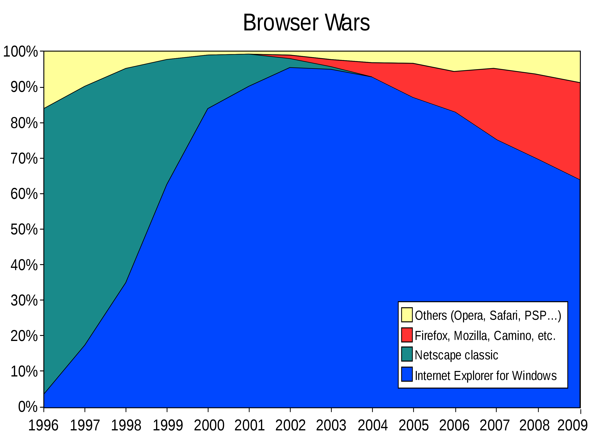{ width=40% }
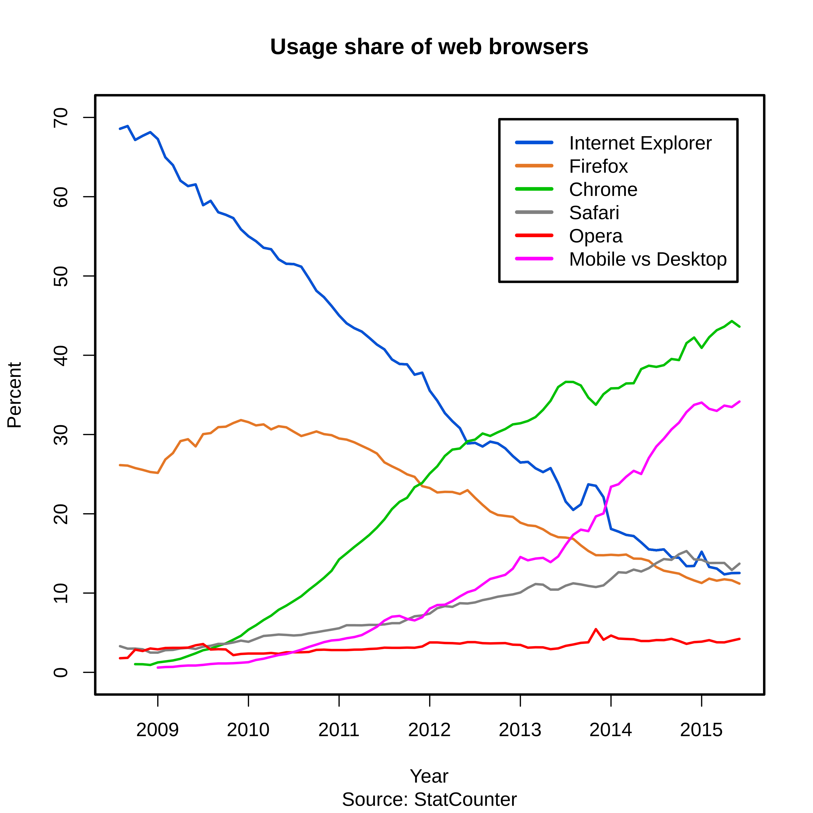{ width=40% }

* Ver [en.wikipedia.org/wiki/Browser_wars](https://en.wikipedia.org/wiki/Browser_wars)

## Las guerras: el servidor

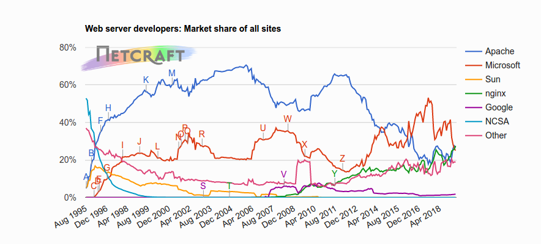{ height=90% }

## Qué recordar

+ Las redes IP llevan poco tiempo: sois los primeros nativos de internet
  - TCP simula conexiones fiables sobre IP
  - UDP es rápido pero no garantiza nada
+ Puedes poner más capas
  - Por ejemplo, seguridad vía TLS; certificados gratis: ¡no hay excusas!
  - La idea de las capas, cada una con sus envoltorios (= cabeceras),\
  da **mucho** juego
+ La web se monta sobre HTTP
  - Estable desde 1996
  - Nuevas versiones disminuyen latencia
  - Historia de la web rica y accidentada; \
  útil conocerla para entender el presente
+ Usaremos Spring MVC sobre Java en el servidor
  - Hay frameworks similares para muchos lenguajes
  - Java fue de los primeros en tenerlos
+ La tecnología cambia mucho
  - La tecnología que aprendais quedará obsoleta en pocos años
  - Pero construirá sobre lo que hay ahora

# Fin

## ¿dudas?

{ width=25% }

This work is licensed under a [Creative Commons Attribution-ShareAlike 4.0 International License](https://creativecommons.org/licenses/by-sa/4.0/)

