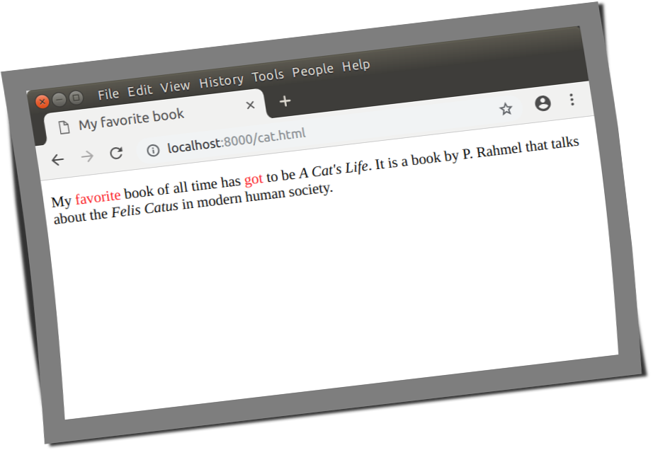
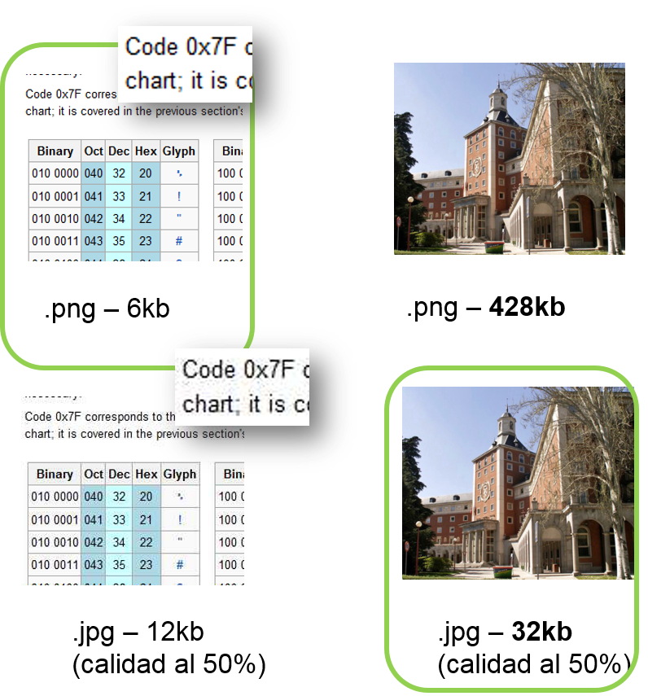
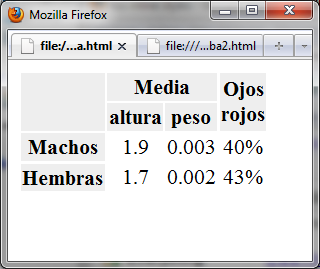
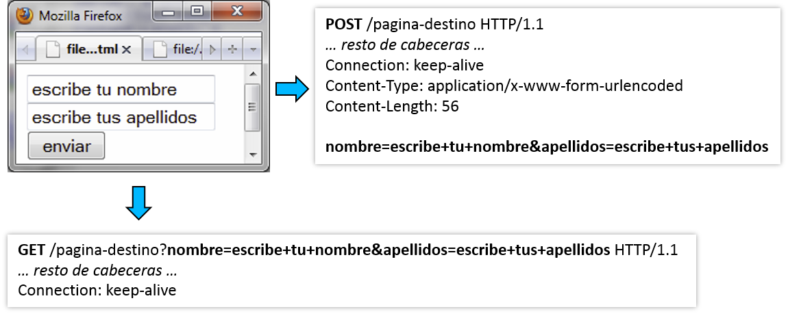
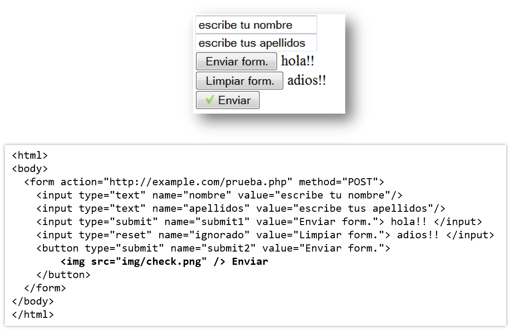
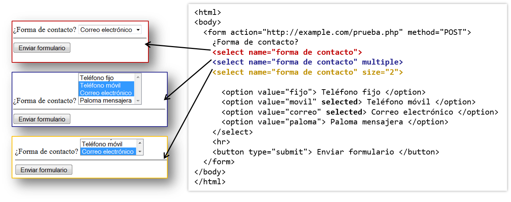
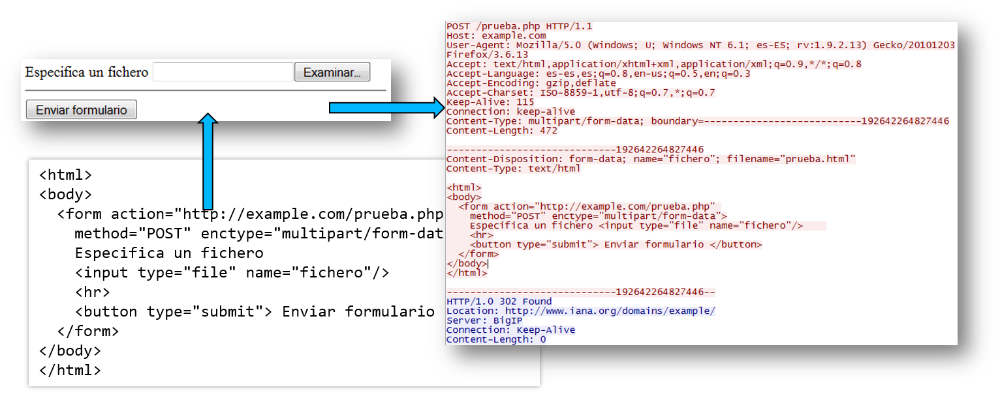

% Introducción a html
% (manuel.freire@fdi.ucm.es)
% 2025.01.27

## Objetivo

> HTML y cómo usarlo, sin entrar en 
> interacción con JS, CSS, ni eventos

## Introducción

- HTML todavía tiene algunas etiquetas y atributos que describen presentación en lugar de estructura
    + **Presentación**: cómo mostrar las cosas (colores, alineamientos, posiciones, tamaños, etcétera)
    + **Estructura**: qué *papel* desempeñan las cosas (encabezado, elemento de lista, párrafo, título de imagen, …)
    + **Contenido**: el texto o recurso a presentar
    + **Comportamiento**: cómo reacciona frente a distintos eventos

- - -

- Usaremos HTML sólo para *estructura* y *contenido*
    + **CSS para presentación**
        - Con marcado HTML, hay que repetir estilos en *cada* elemento
        - Con .css separado, modularidad \
        Y usando el mismo desde varios sitios, reutilización.
    + **JS para comportamiento**
        - Con marcado HTML, hay que repetir comportamientos en *cada* elemento
        - Con .js separado, modularidad \
        Y usando el mismo desde varios sitios, reutilización.

## HTML

- **H**yper**t**ext **M**arkup **L**anguage
    + Hypertext: hipertexto; esencialmente, **texto con _enlaces_**\
    a otros textos/recursos
    + Markup: **marcado** mediante *etiquetas*, para especificar *estructura* y *formato*\footnote{excepto porque ya \emph{no} marcamos formato - del formato se encarga el CSS}
- Enlaces y recursos: 

~~~{.html}
<a href="cuenca.html">enlace a Cuenca</a>
<link rel="stylesheet" type="text/css" href="estilos.css"/>

~~~

- - -

~~~{.html}
<button id="b1" type="submit">Enviar</button> // ejemplo 
~~~

- Marcado y etiquetas:
    + Anatomía

        * **`<`**: comienzo de la etiqueta
        * **`button`**: nombre de etiqueta
        * **`id="b1" type="submit"`**: atributos
        * **`>`**: fin del comienzo; ahora viene el contenido
        * **`Enviar`**: contenido. Posible aceptar texto, etiquetas (posiblemente sólo algunas), o combinaciones de texto y etiquetas. Algunas etiquetas no aceptan nada. 
        * **`</button>`**: cierre de etiqueta
    + Muchos atributos opcionales (id, class, …)
    + Cierre opcional en ciertas etiquetas (`
`, ``, `<li>`, …)
    + A veces, posible usar "autocerrado" 

~~~{.html}
     // equivale a </img>

      <!-- mejor: siempre minúsculas: -->
      
~~~

   + Referencia normativa: [Sección `12.1.2 Elements` del estándar](https://html.spec.whatwg.org/#elements-2) viviente de html5

- Los **atributos**, mejor con comillas dobles (`"`ó simples `'`)

~~~{.html}
 <z id="algo" />  // <!-- comillas dobles                          -->
 <z id='algo' />  // <!-- comillas sencillas; equivale a id="algo" -->
 <z id=algo   />  // <!-- sin comillas y *ni espacios*, también    -->
 <z disabled  />  // <!-- sin =, ni valor; equivale a disabled=""  -->
~~~

## Elementos y atributos no-html5

~~~{.html}
<patata patata="algo"></patata>  // ok*, no muestra nada
<patata>
                   // error: no son pareja
<z />                            // error: no autocerrables
<z>Hola</z>                      // ok*, como div
~~~

- Elementos desconocidos: en general\footnote{/* - en principales navegadores, pero no 100\% estandarizado}, se tratan como `div`
    * equivalentes, pero no intercambiables: cada oveja con su pareja
    * tu página no será "html5 válido" si los usa ...
    * ... a no ser que uses un guión (`<p-atata>`), y te apuntes a 
    [lo último](https://html.spec.whatwg.org/#custom-element)
- Atributos desconocidos: se ignoran (pero disponibles desde JS)
    * mejor usar `data-` atributos: estándares, y más JS-adaptados

## Códigos de escape

- como contenido de **elementos**:
    + `&lt;`  - como una referencia de carácter (usando la [lista oficial](https://html.spec.whatwg.org/#named-character-references))
    + `&#60;` - usando su [código ASCII](https://en.wikipedia.org/wiki/ASCII#Printable_characters), en decimal, a continuación de un `#`
    + `&#x3c;` - lo mismo, pero en hexadecimal, y precedido por `#x`

- como contenido de **atributos**:
    + igual, pero también hay que escapar los cierres (`"` ó `'`, según corresponda)

- en **URLs**:
    + hay que escapar todo lo que no sea `[a-zA-Z-._~]` (ver [rfc3986](https://tools.ietf.org/html/rfc3986)) \
      y si usais `utf8`, esto incluye [acentos o eñes](https://dev.w3.org/html5/spec-LC/urls.html). 
    + se escapa en hexadecimal, prefijando con `%`
    
      normal | en URL | referencia | decimal |   hex  
    --------:|:------:|:----------:|--------:|:------
       `<`   | `%3c`  | `&lt;`     | `&60;`  | `&#x3c;`
       `"`   | `%22`  | `&quot;`   | `&34;`  | `&#x22;` 
       `␣`   | `%20`  | *no tiene* | `&32;`  | `&#x20;` 

## Escapando HTML desde JS

~~~{.js}
  // de https://stackoverflow.com/a/6234804/15472
  function escapeHtml(unsafe) {
    return unsafe
         .replace(/&/g, "&amp;")
         .replace(/</g, "&lt;")
         .replace(/>/g, "&gt;")
         .replace(/"/g, "&quot;")
         .replace(/'/g, "&#039;"); // "&apos;" no siempre existe
  }

  // y escapeURI(unsafe) ya está definida, para URLs
~~~

¿Y porqué escapamos esos caracteres y no otros?

- `&` evita problemas con escapes
- `<` los evita con etiquetas
- `>`, `"` y `'` los evitan cuando estás dentro de una etiqueta o incluso un atributo

## Comentarios

\large

~~~{.html}
  <!-- esto es un comentario-->

  <!-- 
    este comentario
    tiene varias líneas
   -->
~~~

\normalfont

**NO** anides comentarios; las reglas son algo [raras](https://html.spec.whatwg.org/multipage/syntax.html#comments):

- Empiezan con `<!--`
- Luego viene, opcionalmente, texto, que
    + no puede empezar por `>` ni `->`
    + no puede contener `<!--`, `-->`, ó `--!>`
    + no puede acabar por `<!-`
- Acaban con `-->`

## Estructura de un documento

~~~{.html}
  <!DOCTYPE html>
  <html lang="en-US">
  <head>
    <title>My favorite book</title>
    
  </head>
  <body>
    
My <em>favorite</em> book of all time has <em>got</em> to be
    <cite>A Cat's Life</cite>. It is a book by P. Rahmel that talks
    about the <i lang="la">Felis Catus</i> in modern human society.

  </body>
  </html>
~~~

(ejemplo de [https://html.spec.whatwg.org/#the-style-element](https://html.spec.whatwg.org/#the-style-element))

- - - 

{ height=90% }

## Partes de la estructura

- `<!DOCTYPE html>` - dice que estamos usando HTML5
- `<html>` - elemento raíz, engloba todo el documento
- `<head>` - encabezado, para el título, estilos, metadatos sobre el documento, ...
    + `<title>` - el título que aparece en la pestaña
    + `
~~~

## Formularios

~~~{.html}
<form action="acción" method="método">… <form>
~~~
- form – formulario en inglés
- acción – URI destino que recibirá el resultado
    + "mailto:manuel.freire@fdi.ucm.es" – envía por correo
    + "http://www.example.com/respuesta.php" – envío a página
- método – si se envía el resultado a una página, puede ser
    + **`GET`**: método por defecto; Restricciones de tamaño
    Para operaciones idempotentes (ej.: cambios de vista). El navegador no solicita confirmación para repetirlo; transparente a los botones de "adelante" y "atrás" del navegador.
    + **`POST`**: permite el envío de más información, y de tipos más sofisticados (por ejemplo,  ficheros). Para operaciones que implican cambios no-reversibles (ej.: confirmaciones). El navegador solicita confirmación antes de reenviar.

- POST vs GET: ¿estás cambiando algo de forma irreversible?
    + Un botón de 'refrescar listado' puede enviar 'GET'
    + uno de 'borrar archivo' (irreversible) sólo debe enviar 'POST'.

## Controles

- Un formulario se compone de controles (campos) individuales
- Cada control contiene atributos 'name' y 'value'

~~~{.html}
  <!-- enviará nombre=nadie -->
  <input type="text" 
    name="nombre"            
    value="nadie"
  />
~~~

- name: clave del campo
- value: valor inicial (se puede omitir; en general, sobreescribible)

## Enviando por GET vs POST 

- Ambos usan la misma codificación: pares *clave*=*valor*, separados por **'&'**
- Post requiere atributo `method="POST"` en `<form>`
- Get no es necesario especificarlo (pero `method="GET"` también funciona)

{ height=60% }

## Controles clásicos

~~~{.html}
Texto
 corto       <input type="text">
 contraseñas <input type="password">
 largo       <textarea>           <!-- sin input ni type -->

Botones
 clásicos  <input type="button">  <!-- también type=submit, reset -->
 dedicados <button type="button"> <!-- también type=submit, reset -->

Selección
 múltiple  <input type="checkbox">
 única     <input type="radio">
 Menú      <select>

Fichero   <input type="file">

Invisible <input type="hidden">
~~~

## Controles html5

~~~{.html}
Texto
 search   <input type="search">
 tel      <input type="tel">
 url      <input type="url">
 email    <input type="email">
 number   <input type="number">
 
Texto/tiempo
 time       <input type="time">
 date       <input type="date">
 month      <input type="month">
 week       <input type="week">
 fecha+hora <input type="datetime-local">

Otros
 color    <input type="color">
 range    <input type="range">
~~~

## Botones

- Tres tipos:
    + `submit`: botón de envío; envía el formulario a su destino
    + `reset`: pone todos los campos a sus valores iniciales
    + `button`: no hace nada; útil en combinación con JavaScript
    
- Dos variantes; preferible `<button>`:

~~~{.html}
<!-- ignora su contenido; usa 'valor' como etiqueta -->
<input type="tipo" name="identificador" value="valor" />
<!-- contenido (texto, imágenes, …) como etiqueta -->
<button type="tipo" name="identificador" value="valor">…</button>
~~~ 
(nota: tipo puede ser `submit`, `reset` ó `button`)

- Múltiples botones submit y envío del formulario:
    + Se adjunta el par *name*=*value* sólo del botón que haya hecho el envío
    + Si se envía mediante JavaScript, no se adjunta nada.

- - -

{ width=100% }
    
    
## Selección: radio

{ height=90% }

## Selección: checkbox

{ height=90% }

## Selección: select

`<select name="nombre" multiple size="N"> opciones </select>`

  - `multiple`: opcional; si se especifica se permite selección múltiple
    
  - `size`: número de opciones a mostrar por defecto

`<option value="valor" selected> contenido </option>`

  - *valor*: lo que se enviará si se selecciona. Por defecto, 
    el contenido (pero mejor especificarlo)
  - `contenido`: contenido visual de la opción

- - -

{ width=110% }

## Ficheros

`<input type="file" name="nombre" size="N" />`

  - `<form>` debe de tener
    + `method="POST"`
    + `enctype="multipart/form-data"`
  - `size` (opcional): ancho del campo, en caracteres

{ width=110% }

# Fin

## ¿dudas?

{ width=25% }

This work is licensed under a [Creative Commons Attribution-ShareAlike 4.0 International License](https://creativecommons.org/licenses/by-sa/4.0/)
