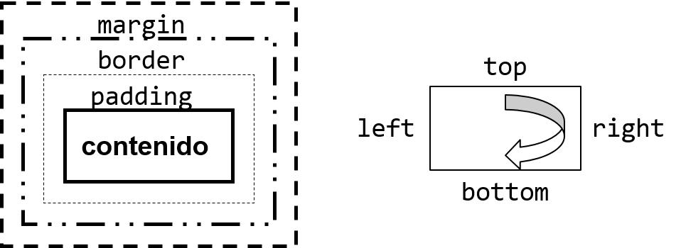
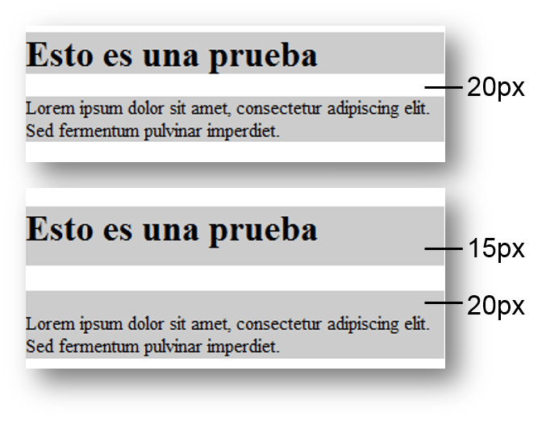
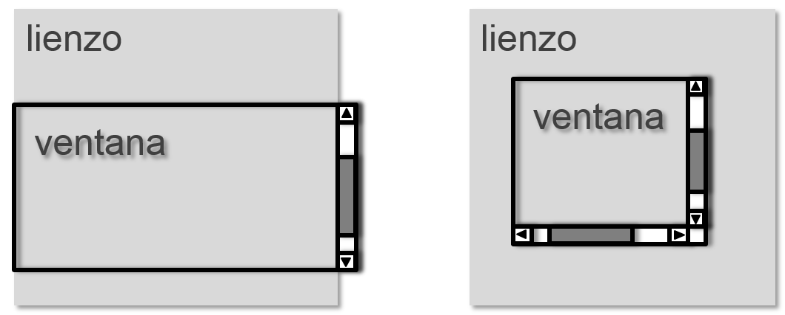
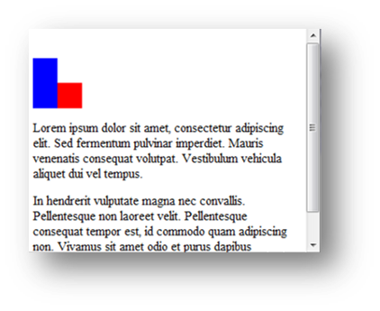
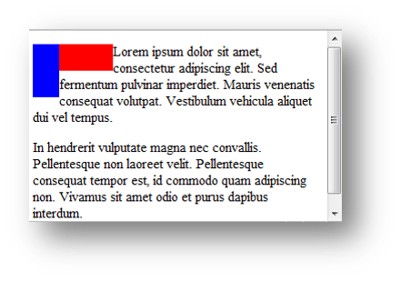
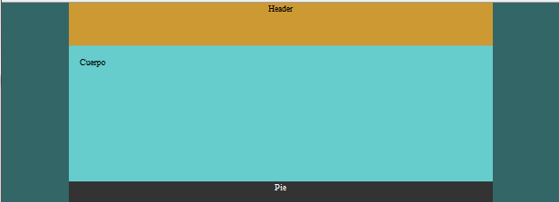
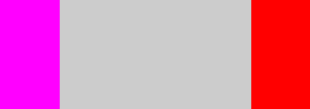
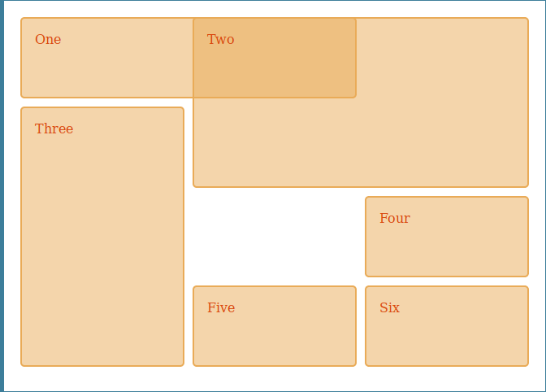
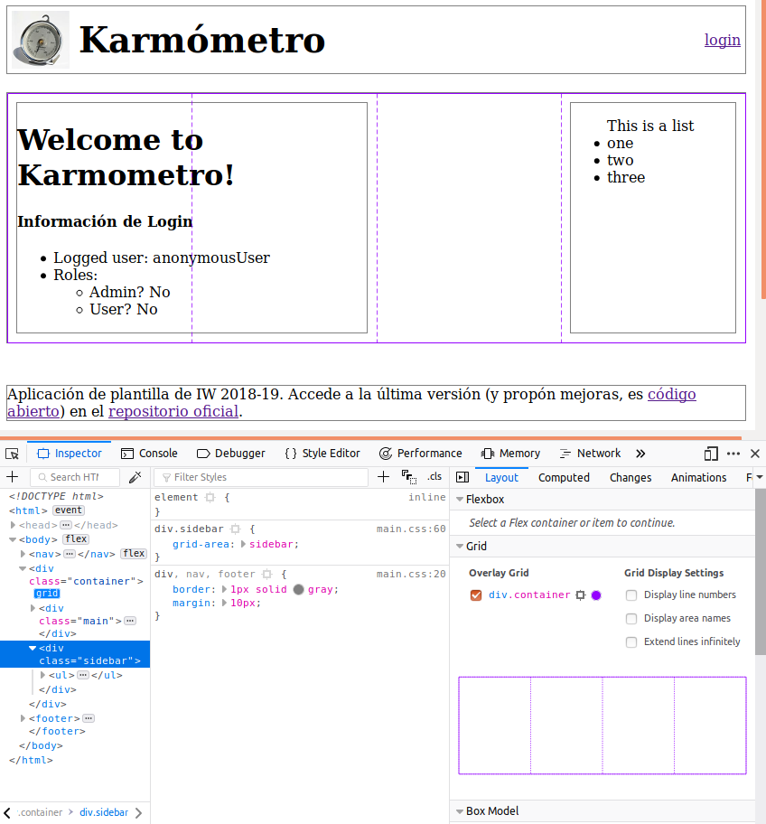

% Introducción a css
% (manuel.freire@fdi.ucm.es)
% 2022.01.31

## Objetivo

> CSS básico y marcado estructural en HTML

## Introducción

- CSS permite estilar páginas web. Hay dos grandes tipos de estilado:
    + *qué va dónde* - la disposición (*layout*) de la página
    + *cómo se pinta cada cosa* - el estilo visual de los elementos
- Pero necesita poder referirse a **fragmentos** de estas páginas para indicar qué estilos usar **dónde**
- Veremos tanto
    + Estructuración de páginas web para facilitar su estilado
    + CSS: estilando/decorando elementos
    + CSS: disposición/colocación de elementos

## Estructuras estilables en HTML

- todos los elementos (`
`, `<body>`, ``) son directamente estilables... 
    + ... pero no todo lo que quieres estilar son elementos sueltos
    + ... puedes querer agrupar cosas para estilarlas (colocar / decorar) juntas.

- elementos *sin representación visual*, que sólo sirven para **estructurar**:
    + ``: marca un fragmento de texto dentro de otro \
    (por ejemplo, una palabra o expresión dentro de un párrafo). 
    + `
`: marca un conjunto de elementos para estilarlos juntos \
    (por ejemplo, un título con varios párrafos).

- con html5, más tipos de `
`s:    
    + `<header>` - para cabeceras
    + `<section>` - para conjuntos de contenidos-principales \
    (ej.: en un periódico, la *sección de deportes*)
    + `<article>` - para elementos de contenido-principal \
    (ej.: en un periódico, una noticia; en un blog, una actualización)
    + `<aside>` - para cosas relacionadas con el contenido principal
    + `<nav>` - para navegar por el sitio
    + `<footer>` - para pies de página

## Identificadores y clases

- Todas las etiquetas HTML aceptan los atributos `id` y `class`
- El valor de `id` 
    + **no puede estar duplicado** en ningún otro elemento del mismo documento
    + no puede contener espacios
- El valor de `class`
    + puede estar duplicado cuantas veces desees
    + si contiene espacios, **cada palabra es el nombre de una clase distinta** \
    (y que el elemento pertenece a *todas* esas clases). 
    + El orden de los nombres de clase es *indiferente*.
    
~~~{.html}
    <!-- clases "uno", "dos", "tres", con id "principal" -->
    
 ... 

    
    <!-- clases "uno" y "dos", con id "secundario" -->
     ... 

    <!-- error, id duplicado -->
    
 ... 
    
~~~

## CSS

- Cascading Style Sheet = Hojas de Estilo en Cascada
    + Definen *estilos* a aplicar a *fragmentos*, identificados por...

~~~{.css}
a { … }               /* tipo: todos los enlaces */
li > a { … }          /* jerarquía: <a>s 1eros hijos de un <li>*/
button#borra_12 { … } /* identificador: botón con id="borra_12" */
button.borrar { … }   /* clase: botones con class="borrar" */
/* ... y combinaciones de los anteriores */
~~~

- Ventajas
    + Separación de Presentación y Contenido
        + Posible cambiar presentación sin tocar contenido, y viceversa
        + Posible aplicar la misma hoja CSS a muchas páginas: consistencia y concisión\
        (en HTML-con-estilos, cada elemento tendría que llevar su estilo…)
        + Posible aplicar distintas hojas CSS a una misma página: distintas presentaciones\
        (ejemplo: pantalla grande, dispositivo móvil, papel, …)
    + CSS permite especificar muchos más estilos que HTML-con-estilos

## Historia

- 1993-6: HyperText Markup Language 1 (borradores circulando desde 1991)
- 1995-11: HTML 2
- 1995-11:  ficheros formularios <input type="file" … />
- 1996-5:  tablas <table> …
- 1996-8:  mapas de imágen en cliente <map name="…"> … CSS 1
- 1997-1:  internacionalización (<… lang="…">, cabeceras)
- 1997-1: HTML 3.2 (w3c)
- 1997-12: HTML 4.0 (strict, transitional, frameset)
- 1998-4: HTML 4.0: corrige errores menores
- 1999-12: HTML 4.01 (strict, transitional, frameset) CSS 2 extiende CSS 1
- 2000-1: XHTML 1.0 ~ HTML 4.0.1 (strict, transitional, frameset)
- 2000-5: ISO HTML
- 2001-5: XHTML 1.1 (basado en strict, modular)
- 2002-2006: XHTML 2.0 (rompe con HTML; descontinuado en 2009)
- 2008: HTML5 + CSS 2.1, corrigiendo CSS2
- 1999-actualidad: CSS3, modular

## Estado de módulos CSS3, según Wikipedia

---------------------------------------------------------------------------------
Module              Specification title                         Status    Date   
------------------- ------------------------------------------- --------- -------
css3-mediaqueries   Media Queries                               Rec       Jun'12

css3-color          Color Module Level 3                        Rec       Jun'18

css3-ui             Basic UI Module Level 3                     Rec       Jun'18

css-fonts-3         Fonts Module Level 3                        Rec       Sep'18

css3-layout         Template Layout Module                      Note      Mar'15

css-cascade-3       Cascading and Inheritance Level 3           CR        May'16

mediaqueries-4      Media Queries Level 4                       CR        Sep'17

css3-background     Backgrounds and Borders Module Level 3      CR        Oct'17

selectors-3         Selectors Level 3                           CR        Jan'18

css3-page           Paged Media Module Level 3                  WD        Mar'13

css3-gcpm           Generated Content for Paged Media Mod.      WD        May'14

css3-content        Generated & Replaced Content Mod.           WD        Jun'16

selectors-4         Selectors Level 4                           WD        Feb'18

css3-multicol       Multi-column Layout Module Level 1          WD        May'18

css3-box            basic box model                             WD        Jul'18
---------------------------------------------------------------------------------
(según [la página de CSS de la wikipedia](https://en.wikipedia.org/wiki/Cascading_Style_Sheets), a febrero de 2019)

## Versiones CSS

- CSS 1
    + Fuentes y propiedades de texto
    + Alineamientos, márgenes, bordes, posicionado\
    (esencialmente, lo que hacía HTML por aquellos momentos)
- CSS 2 / 2.1
    + Z-index, posicionamiento absoluto, relativo y fijo
    + Tipos de medios (papel , proyección, pantalla, pda, hablado…)
    + Soporte para textos izquierda-a-derecha (hebreo, árabe, …)
- CSS 3
    + Varios módulos (~40) independientes
    + En Recommendation / Candidate Recommendation:
        * Más selectores
        * Grid, FlexBox (css3-layout, css-flexbox-1)
        * Cursores y navegación multidispositivo (css-ui)
        * Backgrounds & Borders
        * Media Queries, Namespaces
        * Color
    + Desarrollo prosigue en otros muchos modulos
- comprueba en [caniuse.com](caniuse.com) para saber si usar algo o no. \
(ejemplo con selectores css2: [https://caniuse.com/#feat=css-sel2](https://caniuse.com/#feat=css-sel2))

## Formas de incluir CSS en HTML

- **Embebido**, como parte de una etiqueta HTML

~~~{.html}
  <body> 
Texto en rojo
 </body>
~~~

- **Interno**, como un elemento HTML de tipo **`<style>`**

~~~{.html}
  <head> <style type="text/css"> p { color: red; } <style> </head>
  <body> 
Texto en rojo
 </body>
~~~

- **Externo**, como un fichero referenciado vía **`<link rel="stylesheet">`**
    - *Usad esta variante* (a no ser que tengais muy buena excusa)
    - Sí, a mí también me [parece inconsistente](https://stackoverflow.com/q/14970406/15472) que no haya un `<style src="algo.css">`

~~~{.html}
  <!-- en el html -->
  <head> <link rel="stylesheet" type="text/css" href="ej.css"/> </head>
  <body> 
Texto en rojo
 </body>
~~~
~~~{.css}
  /* en ej.css */
  p {color: red}
~~~

## Anatomía de una hoja de estilos

- Un documento CSS contiene **reglas**, que se componen de 
    * un **selector**, que dice sobre qué elementos (y sus descendientes) se aplican
    * parejas **`propiedad: valor;`**, que dicen cómo estilar los elementos seleccionados

~~~{.css}
/* una regla; selector: `body` */
body {
  font-family: Verdana;
  font-size: 1em;
  text-align: justify
}
/* otra regla; selector: `h1, h2` */
h1, h2 {
  color: blue;
}
/* y una regla más; selector: `code.example` */
code.example {
  font-family: Courier;
  font-size: 1em
}
~~~
    
## Sintaxis CSS

- Comentarios: `/* */`, en cualquier sitio

~~~{.css}
    /* soy un comentario */
~~~

- Directivas (*at-rules*):

~~~{.css}
    @import url(general.css) /* <-- como un #include */
    @media print {           /* <-- aplicada sólo al imprimir */
        font-size: 12pt;
    }
~~~

- Reglas típicas:

~~~{.css}
    h1, h2 {                  /* <-- envueltas en { }  */
        color: blue;          /* <-- acaban en `;` */
        font-family: Courier;
    }
~~~

## Tipos de selectores

- etiquetas, tal cual $\Rightarrow$ **etiqueta**

~~~{.css}
    a { ... }  /* <a ...> ... </a>  */
    p { ... }  /* 
 ... 
      */
~~~

- clases, con `.` $\Rightarrow$  **`.`clase**

~~~{.css}
    a.externo { ... }   /* <a class="externo" ...> ... </a>  */
    p.verso { ... }     /* 
 ... 
        */
~~~

- identificadores, con `#` $\Rightarrow$ **`#`identificador**

~~~{.css}
    a#w3c { ... }       /* <a id="w3c" ...> ... </a>  */
    p#neruda { ... }    /* 
 ... 
   */
~~~

- pseudo-clases y pseudo-elementos, con `:` $\Rightarrow$ **:pseudo**

~~~{.css}
    a:hover { ... }         /* sólo con el ratón encima */
    p:first-letter { ... }  /* sólo la 1ª letra         */
~~~

## Selectores (en CSS 2.1)

----------------------------------------------------------------------------------
Selector                    Significado 
--------------------------- ------------------------------------------------------
*                           Cualquier elemento

etiqueta                    Los elementos HTML con esa *etiqueta*

E.clase / E#id              **E**s de la clase *clase* / con el id *id*

A E                         **E**s que descienden de un **A**ntecesor

P > E                       **E**s *hijos directos* de un **P**adre

P:first-child               Primeros hijos de un **P**adre

E:link / E:visited          **E**s (enlaces) no-visitados (`link`), \
                            ó visitados (`visited`)

E:active / E:hover /        **E**s siendo pulsados, 
E:focus                     que tienen el puntero encima, o que están enfocados                            

E:lang(L)                    **E**s en una declaración de idioma `lang="L"`

H + E                       **E**s precedidos immediatamente por un **H**ermano

E[foo]                      **E**s con atributo `foo`, sea cual sea su valor

E[foo="V"]                  **E**s con atributo `foo` *igual a* `V`

E[foo~="V"]                 **E**s con atributo `foo` que *contienen palabra* `V`

E[foo|="V"]                 **E**s con atributo `foo` que *empiezan* por `V-`

----------------------------------------------------------------------------------

## Algunos selectores CSS 3

----------------------------------------------------------------------------------
Selector                    Significado 
--------------------------- ------------------------------------------------------
H ~ E                       **E**s precedido por un **H**ermano\
                            (con `+`, hermano precede *inmediatamente*)

E[foo^="V"]                 **E**s con atributo `foo` que *empiezan* por `V`\
                            (con `|=`, empieza por `V-`: ojo con el guión)

E[foo*="V"]                 **E**s con atributo `foo` que *contiene* `V`\
                            (con `~=`, `V` debe ser palabra independiente)                                         
                            
F || E                      **E**s que son celdas en una columna con encabezado F

E:not(S)                    **E**s que *no* serían seleccionados por el selector S

E:is(S)                     **E**s que *sí* serían seleccionados por el selector S

E:has(S)                    **E**s donde, aplicando S, algun sub-elemento sería seleccionado
----------------------------------------------------------------------------------

El [estándar de selectores](https://www.w3.org/TR/selectors) tiene también muchas más pseudo-clases, incluyendo:

- :enabled / :disabled / :default $\Rightarrow$ uso en formularios
- :nth-of-type(n) / :nth-last-of-type(n) $\Rightarrow$  para elegir del principio ó el final de un conjunto de elementos
- :nth-child(n) / :nth-last-child(n) $\Rightarrow$  para elegir del principio ó el final de entre los hijos de un elemento dado

## Ejemplos varios

~~~{.css}
    /* `input` justo detrás de un elemento con id `username` */
    #username + input { ... }    
    
    /* campo `input` que te pide tu `username` */
    input[name="username"] { ... }
    
    /* botones con `id` que empieza por el texto `borrar` */
    button[id^=`borrar`] { ... }
    
    /* un montón de cabeceras distintas */
    h1, h2, h3, h4, h5 { ... }
    
    /* elementos de la clase .form-control (y compañía),
       hijos directos de un .input-group;
       sacado del CSS de Bootstrap v4 */
    .input-group > .form-control,
    .input-group > .form-control-plaintext,
    .input-group > .custom-select,
    .input-group > .custom-file { ... }
~~~

## Practicando con selectores

Un juego serio para practicar selectores: [CSS Diner](https://flukeout.github.io/)

{ height=90% }

## Prioridad de selectores

- Versión fácil

> "cuanto más específico el selector, más prioridad tiene"

- Versión algo más exacta: prioridad numérica, con $b$ una base *grande*
    * +$b^0$ puntos por *etiqueta* (= 1)
    * +$b^1$ puntos por *clase* (= 100, si $b=100$)
    * +$b^2$ puntos por *id* (= 10000, si $b=100$)

~~~{.css}
                    /* cuentas con b=100 en plan ilustrativo */
	p {...}                   /* 1                           */
	div p span { ... }        /* 3 = 1 + 1 + 1               */
	div .aviso { ... }        /* 101 = 100 + 1               */
	div .aviso p #feo { ... } /* 10102 = 1 + 100 + 1 + 10000 */
~~~

- En caso de *empate*, últimos ganan:
    + la última regla
    + de la última hoja de estilos cargada

## Prioridad de selectores (y 2)

-----------------------------------
P  Origin              Importance
-- ----------------- --------------
1  CSS Transitions   see below

2  user agent        normal

3  user              normal

4  **author**        normal

5  CSS Animations    see below

6  **author**        !important

7  user              !important

8  user agent        !important
-----------------------------------

Prioridad de hojas de estilo, según [CSS Cascade en la MDN](https://developer.mozilla.org/en-US/docs/Web/CSS/Cascade), donde

- user agent: la hoja de estilos del navegador en sí
- user: especificada por usuario del navegador, *casi nadie la usa*
- author: cargada por la página

El atributo `!important` se puede aplicar a cualquier valor CSS:

~~~{.css}
	p { color: blue !important; } /* mis párrafos van EN AZUL */
~~~

## Propiedades y valores

- Unidades de medida
    + `80% ` $\rightarrow$ Porcentaje (sobre el valor heredado)
    + `12pt` $\rightarrow$ 12 puntos (unidad tipográfica)
    + `2em ` $\rightarrow$ 2x tamaño de la fuente actual (heredado)
    + `2ex ` $\rightarrow$ 2x alto de una `x` en la fuente actual (heredado)
    + `12px` $\rightarrow$ 12 píxeles
    + `12mm` $\rightarrow$ Unidad de medida (valen también cm, in, ...)
    + 0  $\rightarrow$ no requiere unidades (pero si quieres ponerlas, puedes)
    
- Colores
    + `red` $\rightarrow$ por nombre; había otros 17 (ahora hay 140), incluyendo `transparent`
    + `#ff0000` $\rightarrow$ en hexadecimal, con 2 carácteres por canal (rr, gg, bb)
    + `rgb(255, 0, 0)` $\rightarrow$ en decimal, por canales, cada uno entre 0 y 255
    + `rgb(100%, 0%, 0%)` $\rightarrow$ en porcentajes, por canal
    + `hsl(0%, 100%, 50%)` $\rightarrow$ en porcentajes, modelo **h**ue, **s**aturation **l**ightness

- URLs: relativas a la URL de la que se ha descargado el CSS:

~~~{.css}   
        /* si se sirve como parte de css/misestilos.css,
           referencia css/images/header-background.jpg */
        div#header { 
            background-image: url('images/header-background.jpg');  
        }    
~~~

## Propiedades condensadas y expandidas

muchas propiedades van agrupadas, y es posible dar valores a todas a la vez:

- todas a la vez = *propiedades condensadas*
- equivalente a una *declaración expandida*, aunque
    + es más rápido usar la v. condensada
    + tienes que saber su *orden de declaración*
    + es menos legible (si no sabes el orden)
    
~~~{.css}   
/* condensado */
button p { 
    font: bold 9px Charcoal;
}

/* expandido */
button p { 
	font-family: Charcoal; 
	font-style: normal; 
	font-variant: normal; 
	font-weight: bold; 
	font-size: 9px; 
	line-height: normal; 
}
~~~

## Propiedades importantes en texto y listas

~~~{.css}   
/* texto */
font-family: arial;   /* verdana, "Times New Roman", ...      */
    /* si varias separadas por comas, la primera que exista   */
font-size: 100%:      /* cualquier medida, mejor si relativa  */
font-style: normal;   /* o italic, para cursiva               */
font-weight: normal;  /* o bold, para negrita                 */
text-decoration: none;/* o overline, line-through, underline  */
    /* mejor no usar subrayados para no confundir con enlaces */
line-height: normal;  /* cualquier medida, mejor si relativa  */
text-align: left;     /* o right, center, justify             */

/* listas */
/* marcadores: square, decimal, lower-alpha, ...          */
list-style-type: circle; 
/* imagen para los marcadores; url(unaimagen.png)         */
list-style-image(none);
/* si el marcador forma va fuera de la lista o no: inside */    
list-style-position: outside;
~~~

*(valores por defecto; otros posibles valores en comentarios)*

## Modelo de cajas

- Todos los elementos se representan usando un *tipo de caja*
    + **block**: forma un bloque independiente, se suelen colocar unos encima de otros, no "fluyen" cuando se reduce el ancho. 
        * Ejemplos típicos: `
`, `
` ó ``
        * Usad variantes de **`
`** para agrupar y estilar conjuntos de bloques
        * puedes cambiar su tamaño vía CSS con `width` / `height`. Su ancho es, si no lo cambias, el 100% del ancho de su contenedor.
    + **inline**: forma un bloque-en-flujo, y se colocan unos junto a otros, como palabras en una frase, "fluyendo" (= cambiando de línea) cuando no queda más espacio horizontal
        * Ejemplos típicos: `<b>`, `<a>`, ó ``
        * Usad variantes de **``** para agrupar y estilar conjuntos de elementos inline (= cachos de frase).
        * **N**o puedes cambiar su tamaño vía CSS
    + **inline-block**: como un inline, pero no fluye internamente
    + **none**: invisible, no genera caja alguna

- Otros tipos de disposiciones:
    + list-item: para parecer un elemento de una lista
    + table / table-cell / table-column / table-row: para uso en tablas
    + **grid** / **flex**: layout avanzado, \
    tipo GridbagLayout / BoxLayout en Java Swing

- Se puede cambiar el tipo de caja con la propiedad CSS `display`

~~~{.css}
    a { display: none; }        /* ¡ya no se ven los enlaces!      */
    ul, li {display: inline; }  /* ¡elementos de lista sin apilar! */
~~~

## Anatomía de una caja

{ width=70% }

- todas las cajas permiten especificar
    + margin: margen con las cajas vecinas. Márgenes vecinos se *colapsan*
    + border: borde de la caja, incluyendo ancho, color, patrón, ...
    + padding: distancia del contenido al borde
- en estas propiedades
    + versión colapsada usa orden "agujas del reloj"
    + versión extendida usa sufijos `-top`, `-right`, `-bottom`, y `-left`

~~~{.css}
div#x {
    margin: 0;                   /* todos a 0 */
    padding: 10px 5px 0 10px;    /* top, right, bottom, left */
    border-top: 1px solid black; /* linea negra como borde superior */
}
~~~

## Colapso de márgenes

{ width=50% }

~~~{.css}
h1, p { background: #cccccc; }
h1 { margin: 0 0 15px 0; }     /* colapsa: 20px = max(15, 20) */
p { margin: 20px 0 0 0; }
~~~
~~~{.css}
h1, p { background: #cccccc; }
h1 { padding: 0 0 15px 0; }    /* no colapsan */
p { padding: 20px 0 0 0; }
~~~

## Bordes

- `border` = `border-width` + `border-style` + `border-color`
- Hay una cosa llamada `outline` que son igualicas a los `border`, pero no ocupan lugar "de elemento" (son sólo decoración visual).

~~~{.css}   
#x {                           /* borde de 1 pixel rojo            */
    border-width: 1px;         /* cualquier ancho aqui             */
    border-color: red;         /* cualquier color                  */
    border-style: solid;       /* none, dotted, dashed, double, ...*/
}

#y {
    border: 1px dashed blue;   /* borde de 1 pixel azul, a rayitas */
} 
#z {
    border-top: 1px solid black; /* como un 
, pero en CSS!    */
} 
~~~

## Lienzo, ventana y página

{ width=70% }

- Lienzo vs ventana
    - **Ventana** (window): rectángulo por el que se mira a la página.
    - **Lienzo** (canvas): rectángulo en el que se dibuja el contenido de la página; puede ser mayor que la ventana
- Colocación
    - depende del tamaño de la *ventana*, y define el tamaño del *lienzo*
    - la *caja base* CSS adopta el tamaño de la *ventana* actual

## Posicionamiento clásico

- En el *flujo* normal (*flujo* = algoritmo de colocación estándar, con elementos uno tras otro, o si son bloques, uno sobre otro)
    - Estática (**static**): posición "por defecto", donde les tocaría ir.
    - Relativa (**relative**): desplazados de su posición normal, usando propiedades `top`, `right`, `bottom` y `left`.
    - Flotante (**float**): llevado a uno de los lados de la caja contenedora, pero dejando fluir a otros elementos, que le reservan espacio
- Fuera del flujo:
    - Absoluta (**absolute**): fijos con respecto al lienzo. Se mueven si desplazas la vista.
    - Fija (**fixed**): fijos con respecto a la ventana. Se quedan en el mismo sitio, aunque desplaces la vista.

- - - 

~~~{.html}
<!DOCTYPE html>
<html><head><link rel="stylesheet" href="p.css" type="text/css"></head>
    <body>
        

        
Lorem ipsum dolor sit amet, ... 

        
In hendrerit vulputate magna ... 

    </body>
</html>
~~~

~~~{.css}
div#a { background: blue; width: 2em; height: 4em;}
div#b { background: red; width: 4em; height: 2em;}
~~~

"){ width=40% }

- - - 

~~~{.html}
<!DOCTYPE html>
<html><head><link rel="stylesheet" href="p.css" type="text/css"></head>
    <body>
        

        
Lorem ipsum dolor sit amet, ... 

        
In hendrerit vulputate magna ... 

    </body>
</html>
~~~

~~~{.css}
div#a { background: blue; width: 2em; height: 4em;}
div#b { background: red; width: 4em; height: 2em;}
div#a { position: relative; top 2em; } /* <-- azul 2em hacia abajo */
~~~

{ width=40% }

- - - 

~~~{.html}
<!DOCTYPE html>
<html><head><link rel="stylesheet" href="p.css" type="text/css"></head>
    <body>
        

        
Lorem ipsum dolor sit amet, ... 

        
In hendrerit vulputate magna ... 

    </body>
</html>
~~~

~~~{.css}
div#a { background: blue; width: 2em; height: 4em;}
div#b { background: red; width: 4em; height: 2em;}
div { position: float; } /* <-- flotan! */
~~~

{ width=40% }

- - - 

~~~{.html}
<!DOCTYPE html>
<html><head><link rel="stylesheet" href="p.css" type="text/css"></head>
    <body>
        

        
Lorem ipsum dolor sit amet, ... 

        
In hendrerit vulputate magna ... 

    </body>
</html>
~~~

~~~{.css}
div#a { background: blue; width: 2em; height: 4em;}
div#b { background: red; width: 4em; height: 2em;}
div#a { position: absolute; } /* <-- azul: absolute */
~~~

\begin{figure}[ht]
    \begin{minipage}[b]{0.45\linewidth}
        \centering
        \includegraphics[width=\textwidth]{img/position-absolute-or-fixed.png}
        \caption{antes de hacer scroll}
    \end{minipage}
    \hspace{0.5cm}
    \begin{minipage}[b]{0.45\linewidth}
        \centering
        \includegraphics[width=\textwidth]{img/position-absolute.png}
        \caption{después de hacer scroll}
    \end{minipage}
\end{figure}

- - - 

~~~{.html}
<!DOCTYPE html>
<html><head><link rel="stylesheet" href="p.css" type="text/css"></head>
    <body>
        

        
Lorem ipsum dolor sit amet, ... 

        
In hendrerit vulputate magna ... 

    </body>
</html>
~~~

~~~{.css}
div#a { background: blue; width: 2em; height: 4em;}
div#b { background: red; width: 4em; height: 2em;}
div#a { position: fixed; } /* <-- azul: fixed */
~~~

\begin{figure}[ht]
    \begin{minipage}[b]{0.45\linewidth}
        \centering
        \includegraphics[width=\textwidth]{img/position-absolute-or-fixed.png}
        \caption{antes de hacer scroll}
    \end{minipage}
    \hspace{0.5cm}
    \begin{minipage}[b]{0.45\linewidth}
        \centering
        \includegraphics[width=\textwidth]{img/position-fixed.png}
        \caption{después de hacer scroll}
    \end{minipage}
\end{figure}

## Float, display, y clear

- Float
    - puede ser 
        * `right` ó `left` (clásico)
        * `inline-start` ó `inline-end` (nuevo), \
        teniendo en cuenta el lado *comienzo* en el idioma actual)
    - su contenido se considera `display: block`\
    (aunque no lo fuera normalmente)
- Se coloca
    - tocando el `padding` del elemento que lo contiene, ó
    - al lado de un `float` previo en esa dirección
- posible forzar espaciado con float anteriores vía `clear`
    - `right`, `left`, `float`: a qué floats anteriores afecta

## Ejemplo de posicionamiento clásico 1

~~~{.css}
html, body {
    margin:0; padding:0; height: 100%; background-color: #366;
}
#capaMadre {
    width: 790px; background-color: #6cc;
    margin: 0 auto;         /* <-- margin auto = centrado */
    position: relative;
    height: auto!important;
    min-height: 100%;
    height: 100%;
}
#cabecera {
    background-color: #c93; text-align: center; height:80px;
}
#cuerpo {
    position: relative; display: block; margin: 20px;
}
#pie {
    position: absolute; bottom: 0; height: 40px;
    background-color: #333; color: #fff; text-align: center;
    width: 100%; clear: both;
}
~~~

- - - 

{ width=70% }

~~~{.html}
<!-- ... -->

    
Header

    
Cuerpo

    
Pie

<!-- ... -->
~~~

- No-responsive (*responsive* = que se adapta al contexto):
    + usa tamaños fijos para ancho de pantalla, alto de cabecera y pie
    + no se adapta a tamaño real de pantalla, ni al de los contenidos

## Ejemplo de posicionamiento clásico 2

~~~{.css}
* {margin:0;padding:0;}
html, body {
    height: 100%;
}
#contenedor {
    width: 100%; height: 100%; margin:0;
}
#col_der, #col_izq, #col_cen {
    height: 100%;
}
#col_der {
    float: right; width: 200px; background-color: #f00;
}
#col_izq {
    float: left; width: 200px; background-color: #f0f;
}
#col_cen {
    background-color: #ccc;
}
~~~

- - - 

{ width=70% }

~~~{.html}
<!-- ... -->

    
derecha

    
izquierda

    
centro

<!-- ... -->
~~~

- Algo más "responsive"
    + se convierte en 2, o incluso 1 columna, si no hay suficiente ancho
    + pero sigue usando tamaños fijos para ancho de columnas

## Layouts modernos: flex y grid

* `display: flex`, también llamado *flexbox*
    - para secuencias de elementos organizadas a lo largo de un eje
    - por ejemplo, permite hacer "layouts" de columnas muy fácilmente
    - recuerda al `BoxLayout` de Java Swing
    - hay muchos [ejemplos y detalles de flex en la MDN](https://developer.mozilla.org/en-US/docs/Web/CSS/flex)

* `display: grid`
    - para usar la metáfora de una tabla
    - (pero sin usar una tabla de verdad, porque eso sería semánticamente feo)
    - más complejo, pero potencialmente más potente
    - recuerda al `GridbagLayout` de Java Swing
    - hay muchos [ejemplos y detalles de grid en la MDN](https://developer.mozilla.org/en-US/docs/Web/CSS/grid-column)

## Flex: ejes principales y secundarios

* eje principal ("línea") puede ser
    - `row`, `column` siguiendo posicionamiento inline y de bloque, respectivamente
    - `row-reverse`, `column-reverse` para invertir el orden de los elementos
* eje secundario permite justificar y alinear elementos

](img/mdn-writing-mode.png){ height=50% }

- - - 

](img/mdn-writing-mode-2.png){ width=80% }

- - - 

* si no caben más elementos en una línea del eje principal
    - por defecto, o encogen bien o no se ven
    - posible usar `wrap`

~~~{.css} 
    .box { 
        display: flex; 
        flex-flow: row wrap;  /* flex-direction + flex-wrap */         
    }
~~~

* controlas cuánto espacio se lleva cada uno usando `grow`, `shrink` y `basis`:
    - `grow`: cuando sobra espacio, cuánto compite por crecer
    - `shrink`: cuando falta espacio, cuánto compite por encoger
    - `basis`: tamaño de base, donde `auto` es /lo normal/

~~~{.css} 
.box   { display: flex; }  /* por defecto, row & no-wrap */
.one   { flex: 1 0 auto; } /* 1/3 de espacio sobrante, no encoge */
.two   { flex: 2 1 auto; } /* 2/3 de espacio sobrante, encoge  */
.three { flex: none; }     /* como 0 0 auto: su tamaño y punto */
~~~

## Flexbox: alineamiento

* eje principal: 
    - `justify-content` para repartir espacio vacío en *este* eje
    - `align-content` si resulta tener varias filas\footnote{o, si usamos columnas, para controlar cómo se reparten el espacio horizontal}, \
    para controlar cómo se reparten el espacio vertical
* eje secundario: 
    - `justify-items` para repartir espacio vacío en *este* eje \
    (por ejemplo, si esto es una fila, en horizontal)
    - `align-items` para repartir espacio vacío a contraeje \
    (por ejemplo, si esto es una columna, en vertical)
    - `align-self` para modificar el alineamiento a contra-eje de 1 único elemento
* opciones:
    - `space-around` & `space-between`: espaciando, incluyendo o no los extremos
    - `flex-start` & `flex-end` & `center`: apelotonarlos a un lado, al otro, o al centro
    - `stretch`: intenta estirarlos para ocupar todo el espacio

## Ejemplo de alineación del eje secundario

](img/mdn-flex-align.png){ width=60% }

~~~{.html}

  
One

  
Two

  
Three

  
Four

~~~

~~~{.css} 
/* css */
.box {  display: flex;
        align-items: flex-start;
        height: 200px; }
.box>*:first-child { align-self: stretch; }
.box .selected     { align-self: center; }     
~~~

## Separando vía margin

~~~{.css}
    /* en el css */
    .push { margin-left: auto; }
~~~

~~~{.html}
    <!-- html, un div de varios dentro de un flex -->
    
Four

~~~

](img/mdn-flex-margin.png){ width=80% }

## Layout responsive con flex

* Usa `wrap` para que quepan más o menos elementos por línea\footnote{o columna, que para gustos colores}
* Usa `@media` para hacer que ciertas reglas sólo se apliquen a partir de ciertos puntos:

~~~{.css}
.row {                                 /* flex con wrap activado */
  display: flex;
  flex-flow: row, wrap;
  width: 100%;
}
.column, .double-column {              /* items ocupan todo el ancho */
  display: flex;
  flex-direction: column;
  flex: 0 0 100%;
}
@media screen and (min-width: 800px) { /* excepto en pantalla grande */
  .column { flex: 1 }
  .double-column { flex: 2 }
}
~~~

(ejemplo disponible [online](https://codepen.io/drews256/pen/bjzpvd), sacado del [blog de \@drews256](https://dev.to/drews256/ridiculously-easy-row-and-column-layouts-with-flexbox-1k01) )

## Layout complejo con grid

~~~{.css}
.wrapper {
  display: grid;
  grid-template-columns: repeat(3, 1fr);
  grid-gap: 10px;
  grid-auto-rows: minmax(100px, auto);
}
.one { 
  grid-column: 1 / 3; /* comienzo (inclusive) / final (exclusive) */
  grid-row: 1;        /* equivale a 1 / 2; empieza a contar en 1  */
}
/* ... */
~~~

{ width=40% }

## Depurando layouts con F12

~~~{.css}
/* ... */
div.container {
    display: grid;
    grid-template-columns: repeat(4, 1fr);
    grid-template-rows: auto;
    grid-template-areas: 
        "main main . sidebar"
}
div.content { grid-area: main; }
div.sidebar { grid-area: sidebar; }
~~~

~~~{.html}
<!-- ... -->

    <!-- ocupo 2 columnas -->

    <!-- ocupo columna del final -->

<!-- ... -->
~~~

- - - 

{ width=90% }

# Bootstrap

## Introducción

- Desarrollada por Twitter para su interfaz web
   + aparece en 2011, layout revolucionario
       - 2012: bootstrap 2, con glyphicons y responsive
       - 2013: bootstrap 3, "flat design", sin soporte para IE7
       - 2014-18: bootstrap 4, flexbox, rediseño completo
       - 2021: bootstrap 5, deja de usar JQuery, iconos propios
   + 11º proyecto por [número de estrellas en GitHub](https://github.com/EvanLi/Github-Ranking/blob/master/Top100/Top-100-stars.md)
- Librería de estilos CSS "responsive"
   + **nadie escribe CSS desde cero** (y boostrap genera el suyo vía SASS)
   + competidores en CSS:
       - materialize (google)
       - foundation (zurb)
       - uikit (yootheme)
       - ... muchos, muchos más
   + otras opciones de frontend web: react, angular, vue, ... no se limitan al CSS

## Conceptos clave

- Boostrap = estilos y algo de comportamiento
  + un .css al principio (en tu `<head>`)
  + un .js al final (justo antes de cerrar tu `<body>`)
- Layout = disposición de elementos en página
  + tamaño de pantalla dicta disposición según **breakpoints**, en colaboración con **contenedores** (grande, pequeño, estirable, ...)
  + grid (por debajo, flexbox) fácil de usar, con filas y columnas.
  + reparto basado en 12 = todo, 6 = mitad, 4 = 1/3, ...
  + sistema de **gutters** para espaciar filas/columnas
- Cambios a "estilo por defecto" y componentes extra
  + formularios reestilados, y validación más sencilla 
  + 23 componentes adicionales, y en particular
  + accordion (expanden/contraen para mostrar/ocultar detalles)
  + card (para mostrar ítems estructurados)
  + modales (para solicitar detalles)
  + navbar (para usar como menú/barra superior de una aplicación)
  + nav&tab (para generar interfaces tabuladas)

## Layout: breakpoints

{ height=60% }

Si pides `md` pero no hay suficientes píxeles, entonces tu solicitud no se tiene en cuenta, y se pasa a "columna única".

## Layout: ideas

~~~{.html}

 <!-- sin container, ignoraría row y col -->
  
 <!-- primeras 2 iguales, en todos los tamaños -->
    
 col 

    
 col 

    
 me ajusto a mi contenido 

  

  
 <!-- relacion 3:1 -->
    
 col-9 

    
 col 

  

  
 <!-- colapso cuando llegue a sm -->
    
col-sm-8

    
col-sm-4

  

~~~

- `row` = soy una fila, y voy a contener columnas (`col`)
- `col-sm-4` = quiero ocupar 1/3 del ancho, pero me colapso si llego a  `sm`
- `col-auto` = dame lo que ocupo, y nada más
- detalles: [https://getbootstrap.com/docs/5.2/layout/grid](https://getbootstrap.com/docs/5.2/layout/grid)
- este ejemplo en [https://jsfiddle.net/mfreire/s3tbmj5g/](https://jsfiddle.net/mfreire/s3tbmj5g/)

- - - 

## Formularios

ver [https://getbootstrap.com/docs/5.2/forms/validation/](https://getbootstrap.com/docs/5.2/forms/validation/)

\small

~~~{.html}
<form class="row g-3">
  

    <label for="fname" class="form-label">First name</label>
    <input type="text" class="form-control" id="fname" value="Mark"
     required> <!-- validación del propio navegador -->
  

    

    <label for="lname" class="form-label">Last name</label>
    <input type="text" class="form-control" id="lname" value="Otto" 
    required>
  

  

    <label for="uname" class="form-label">Username</label>
    

      @
      <input type="text" class="form-control" id="uname" 
          aria-describedby="inputGroupPrepend2" 
    required>
    

  

    

    <button class="btn btn-primary" type="submit">Submit form</button>
  

</form>

~~~

\normalfont

- - -

Etiquetando campos:

  - Usad `<label for="idDeControl"><input id="idDeControl" ...>` para asociar etiquetas con controles. 
  - O, si queréis ahorrar espacio, `<input id="idDeControl" placeholder="cosaQueDesapareceCuandoEscribes" ...>`
  - O incluso símbolos: `@` + `aria-describedby="inputGroupPrepend2"`

Etiquetar cosas es importante - y uno de los requisitos principales de **ARIA** (Accessible Rich Internet Applications). Para más sobre **accesibilidad**: [WAI-ARIA](https://www.w3.org/TR/wai-aria-practices-1.1/)

## Componentes: navbar

Permite montar una barra de navegación (ver [docs/5.2/components/navbar](https://getbootstrap.com/docs/5.2/components/navbar/)) con 

  - título/logo (`navbar-brand`)
  - enlaces (`nav-item` + `nav-link`)
  - búsqueda (`input` con `type="search"`)
  - enlaces en menús desplegables (útil para detalles/logout), vía `nav-item dropdown` y compañía.

Una barra de navegación típica:

{ height=20% } 

La misma barra, cuando hay poco espacio:

{ height=5% } 

## Componentes: accordion

Permite mostrar/ocultar detalles. Ver [docs/5.2/components/accordion](https://getbootstrap.com/docs/5.2/components/accordion/)

\small

~~~{.html}

  

    <h2 class="accordion-header" id="headingOne">
      <button class="accordion-button" type="button"
       data-bs-toggle="collapse" data-bs-target="#collapseOne"
       aria-expanded="true" aria-controls="collapseOne">
        Accordion Item #1
      </button>
    </h2>
    

      

        Muchos detalles aquí
      

    

  

  

    ...
  

~~~

\normalfont

## Componentes: card

Para mostrar información en formato postal (= tamaño fijo), generalmente usado para poner muchos juntos. Ver [docs/5.2/components/card](https://getbootstrap.com/docs/5.2/components/card/)

~~~{.html}

  
  

    <h5 class="card-title">Card title</h5>
    
Some quick example text to build on the card title 
        and make up the bulk of the card's content.

  

  <ul class="list-group list-group-flush">
    <li class="list-group-item">An item</li>
    <li class="list-group-item">A second item</li>
    <li class="list-group-item">A third item</li>
  </ul>
  

    <a href="#" class="card-link">Card link</a>
    <a href="#" class="card-link">Another link</a>
  

~~~

## Componentes: modales

Para mostrar un diálogo emergente que no te deja hacer nada hasta que lo rellenas. Útil para, por ejemplo, pedir detalles sobre algo sin incluir un formulario siempre visible. Más en [docs/5.2/components/modal](https://getbootstrap.com/docs/5.2/components/modal/)

\small

~~~{.html}
<button type="button" class="btn btn-primary" data-bs-toggle="modal" 
 data-bs-target="#exampleModal">Click me!</button>

  

    

      

        <h5 class="modal-title" id="exampleModalLabel">Titulo</h5>
        <button type="button" class="btn-close"
         data-bs-dismiss="modal" aria-label="Close"></button>
      

      
 ... cuerpo ... 

      

        <button type="button" class="btn btn-secondary" 
         data-bs-dismiss="modal">
          Cerrar</button>
        <button type="button" class="btn btn-primary">
          Aceptar</button>
      

    

  

~~~

\normalfont

## Componentes: nav&tab

Para mostrar pestañas y pasar de una a otra. Detalles en [docs/5.2/components/navs-tabs](https://getbootstrap.com/docs/5.2/components/navs-tabs/)

~~~{.html}
<ul class="nav nav-tabs">
  <li class="nav-item">
    <a class="nav-link active" aria-current="page" href="#">
      Active</a>
  </li>
  <li class="nav-item">
    <a class="nav-link" href="#">Link</a>
  </li>
  <li class="nav-item">
    <a class="nav-link" href="#">Link</a>
  </li>
  <li class="nav-item">
    <a class="nav-link disabled" href="#" tabindex="-1" 
     aria-disabled="true">Disabled</a>
  </li>
</ul>
~~~

## Componentes: badge

Para mostrar etiquetas pequeñas y, posiblemente, llamar la atención del usuario. Detalles en [docs/5.2/components/badge](https://getbootstrap.com/docs/5.2/components/badge/)

~~~{.html}
<button type="button" class="btn btn-primary position-relative">
  Inbox
  
    99+
    unread messages
  
</button>
<!-- y con más colores; text-dark evita blanco-con-fondo-claro -->
Primary
Secondary
Success
Danger
Warning
Info
Light
Dark
~~~

## Componentes: tooltips

El atributo `title` sirve para poner tooltips. Pero para que queden más bonitos, puedes usar `data-bs-toggle="tooltip"`, y ya puestos elegir dónde colocarlos (usando *popper.js*, integrado en tu `bootstrap.bundle.js`). Detalles en [docs/5.2/components/tooltips](https://getbootstrap.com/docs/5.2/components/tooltips/)

~~~{.html}
<button type="button" class="btn btn-secondary"
 data-bs-toggle="tooltip" data-bs-placement="top" 
 title="Tooltip on top">
  Tooltip on top
</button>
<button type="button" class="btn btn-secondary" 
 data-bs-toggle="tooltip" data-bs-placement="right" 
 title="Tooltip on right">
  Tooltip on right
</button>
<!-- e igual para bottom ó left; y si especificas 
     data-bs-html="true" puedes insertar html
-->
~~~

# Fin

## ¿dudas?

{ width=25% }

This work is licensed under a [Creative Commons Attribution-ShareAlike 4.0 International License](https://creativecommons.org/licenses/by-sa/4.0/)
