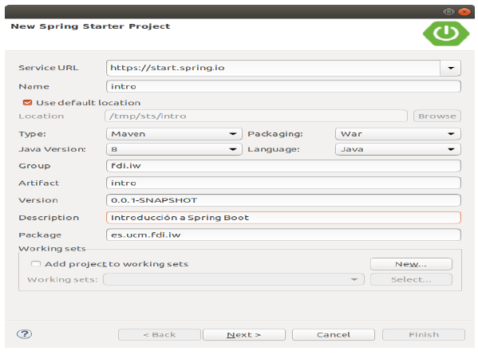
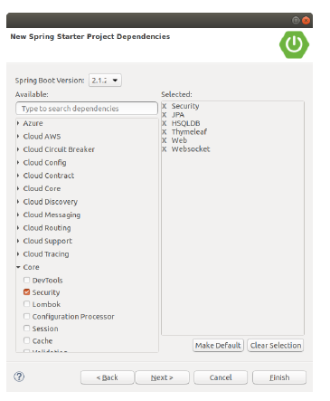
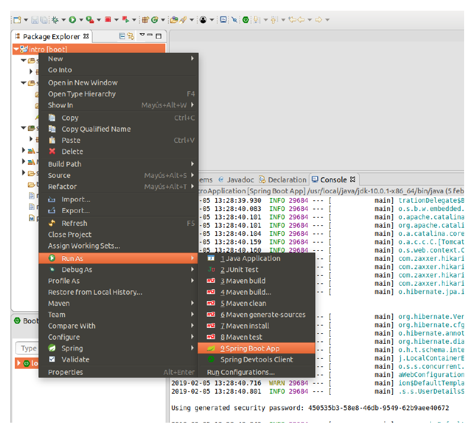
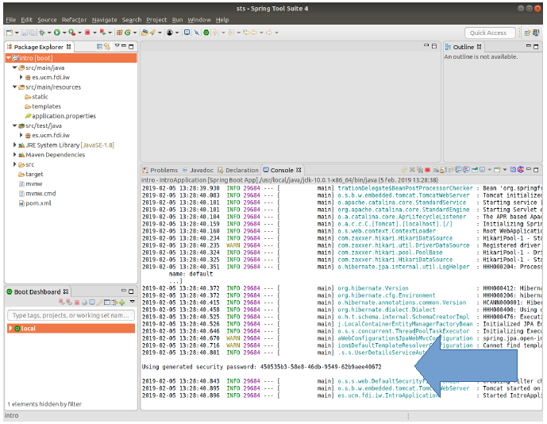
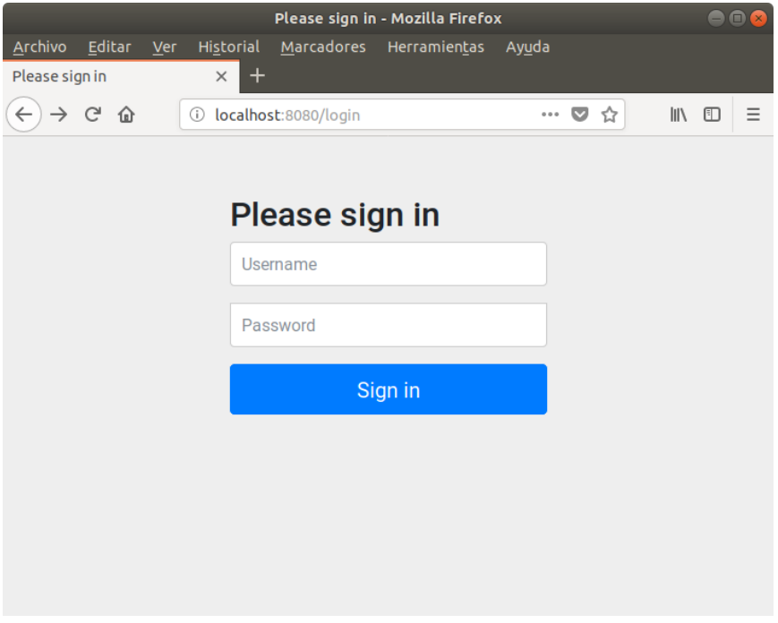
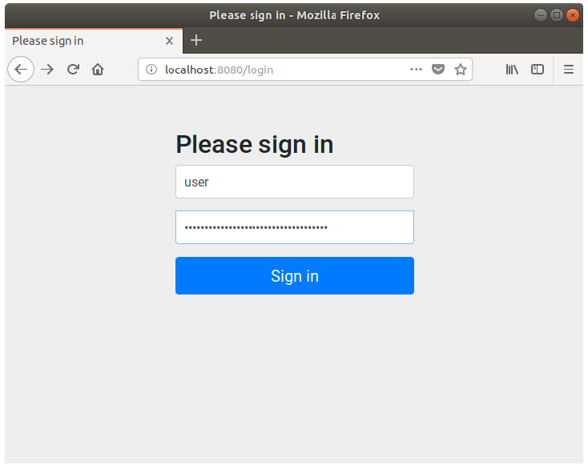
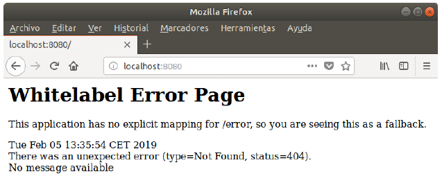
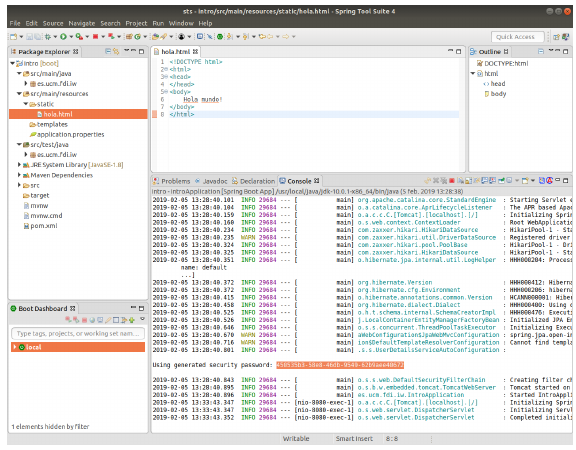
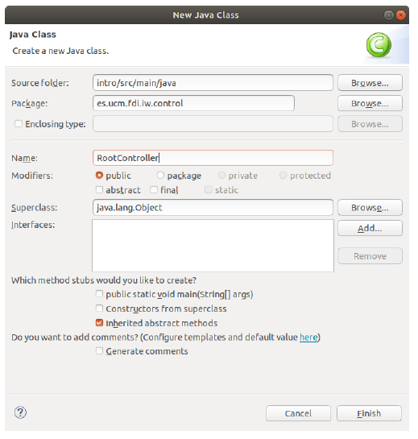

% Entorno de laboratorios
% (manuel.freire@fdi.ucm.es)
% 2022.01.31

## Objetivo

> Crear y usar un proyecto básico con tecnologías del curso

## Introducción

* Qué es Spring
* Un IDE para Spring: STS
* Maven
* Montando un proyecto Spring MVC sencillo

## Spring

* Problema inicial: J2EE (Java 2 Enterprise Edition). Mucha funcionalidad, 
    - pero hay que *configurar* toda esa funcionalidad, incluso si no la usas
    - eso exige unos 3 ficheros XML y 2-3 clases e interfaces *por componente*
    - los identificadores para buscar componentes colaboradores, *a pincho*

* Spring Framework 
    - 2002: 0.9 - Interface21, por eso del siglo XXI; ID + POJOs
    - 2004: 1.0 - empieza a llamarse Spring, por contraposición al invierno J2EE
    - 2006: 2.0 - configuración vía anotaciones (= sin XML separado; en 2.5)\
        autodetección de componentes en el *classpath*
    - 2009: 3.0 - soporte para Java 5 (genéricos), SPEL, BD embebidas, REST
    - 2013: 4.0 - Spring Boot, WebSockets, 
    - 2017: 5.0 - reactive streams

## Conceptos clave

* ID: Inversión de Dependencias
    - "no me llames a mí, ya te llamaré yo a tí" (*Hollywood Principle*)
    - evitas hacer el `new`; te lo entregan desde fuera en el último momento
    - `@Bean`, `@AutoWired`
    - desacopla mucho, y facilita pruebas
* Configuración vía anotaciones + escaneado del classpath
    - Java puede hacer introspección de sus clases
    - Y detectar qué anotaciones llevan (`@Controller`, `@Transactional`, ...)
    - Y modificarlas según esas anotaciones, *evitándote escribir mucho código*
    - Y es mucho más DRY que mantener ficheros `.xml` sincronizados con código
* POJO: Plain Old Java Object
    - usar objetos java estándares, con sus `get` y sus `set` en todo caso, \
    en lugar de implementar o extender clases complejas
    - evita tener que entender, usar, o casarse con unas clases complejas

## Spring en la actualidad

* Unos 22 proyectos de 1er nivel, incluyendo
    - Framework: inyección de dependencias, anotaciones, ...
    - WebFlux ("reactivo") ó MVC (clásico)
    - Boot: lanza cualquier cosa de forma fácil
    - Cloud: gateway, microservicios, brokers, registros, dashboards ...
* Muy usado
](img/dev-ecosystem-java-2019.png){ height=60% }

## Eclipse y STS

* Spring es integrable en distintos IDEs vía Spring Tools:
    - Eclipse
    - VS Code (Microsoft, pero abierto)
    - Theia (competidor de Code, Eclipse-esposorizado)
* STS = Eclipse con Spring Tools preinstalado
    - Spring Tools Suite 4

* No obligatorio: posible usar cualquier IDE ó SSOO
    - *tiene* que poder funcionar en laboratorios (maven + JDK8)
    - recomiendo usar Linux (mejor consola)    

## Maven

* Automatización de proyectos Java / repositorio de artefactos
    - `pom.xml`: Project Object Model, el recetario del proyecto. Incluye
            - dependencias
            - recetas para distintas fases del ciclo de vida
            - salidas (para poder usarlo como dependencia externa)
    - el pom es feo. Por eso existen Gradle, Ivy, Grape, ... 
    - unos 320k artefactos únicos en [Maven Central](https://search.maven.org/stats)
    - una dependencia (y sus dependencias): 5 líneas

~~~{.xml}
<dependency>
    <groupId>org.apache.pdfbox</groupId>
    <artifactId>pdfbox</artifactId>
    <version>2.0.18</version>
</dependency>
~~~

* Soportado por todos los IDEs para sus proyectos
    - pero algunos se obstinan en usar su propio formato: \
        Eclipse usa `.classpath` y `/project`, ambos regenerables vía importación
* Uso desde línea de comando permite
    - pruebas rápidas
    - uso vía SSH sobre un contenedor Docker (más adelante)

## Creando el proyecto

- Todo proyecto maven necesita un nombre, grupo, artefacto y versión. 
- `grupo:artefacto` + versión para usarlo como dependencia

{ height=50% }

- - -

Ahora seleccionamos componentes

{ height=60% }

## Ejecutando el proyecto

También puedes lanzarlo vía línea de comando: `mvn spring:boot`

{ height=60% }

- - -

* Tendrás que relanzarlo tras cada cambio
    * icono de *stop*+*play*
    * si usas *play* sin hacer *stop*, te dirá que el puerto 8080 ya está ocupado
* Es posible hacer que cambios en plantillas (no-java) se recarguen automáticamente
    * por tanto, tocar plantillas es barato
* Los cambios en java siempre requieren relanzar todo; aunque se pueden automatizar
    * tocar código java es más lento, y rompe sesiones

## Lanzando el proyecto: la contraseña

{ height=70% }

## Login & Logout

* Por defecto, todas las páginas estarán protegidas por un login
* Puedes cambiarlo. Hasta que lo hagas, `user` y lo que diga el log al arrancar

{ height=60% }

- - - 

{ height=70% }

## Páginas estáticas

El servidor está funcionando en `http://localhost:8080/`. \
Ojo con la última `/`: es obligatoria.

{ height=60% }

- - -

Introduciendo una primera página estática

{ height=50% }

## Controlador básico

{ height=70% }

- - -

~~~{.java}
package es.ucm.fdi.iw.control;

// rellena los imports con Ctrl+O (eclipse)

@Controller
public class RootController {
    @GetMapping("/")                        // peticion a `/`
    public String index(
            Model model,                    // comunicación con vista
            @RequestParam String name) {    // viene del formulario
        model.addAttribute("name", name);   // escribe en modelo
        return "hola";                      // vista resultante
    }
}
~~~

## Plantilla thymeleaf

- Debe ir en en `src/main/resources/templates/hola.html`
    - y así, cualquier *Mapping* que devuelva `hola` podrá encontrarla
- Estás usando *thymeleaf* como motor de plantillas:
    - ficheros .html; se pueden ver y abrir de forma normal en navegador
    - ... pero si los tratas como .html, no substituyen nada

~~~{.html}
<!DOCTYPE html>
<html xmlns:th="http://thymeleaf.org">
<head></head>
<body>
    Hola, alguien!
</body>
</html>
~~~

## Controlando la seguridad

- Es muy aburrido estar siempre haciendo login. 
- Usa un `SecurityConfig.java` para desactivarlo en ciertas páginas

~~~{.java}
package es.ucm.fdi.iw;

// muchos imports, usa Ctrl+O (eclipse)

@EnableWebSecurity
public class SecurityConfig extends WebSecurityConfigurerAdapter {
    protected void configure(HttpSecurity http) throws Exception {
	    http
	        .authorizeRequests()
	            .antMatchers("/**").permitAll()	 // "/**" = todo
                .anyRequest().authenticated()
	            .and()
	        .formLogin()
	        	.permitAll();
	}
}
~~~

## El log

- Para poder diagnosticar el funcionamiento de la aplicación, usaremos el *log*
- Modifiquemos un poco el controlador:

~~~{.java}
// ...
@Controller
public class RootController {

    private static Logger log = LogManager.getLogger(
        RootController.class);

    @GetMapping("/")                        // peticion a `/`
    public String index(
            Model model,                    // comunicación con vista
            @RequestParam String name) {    // viene del formulario
        
        log.info("El usuario dice que se llama {}", name); 
        // ...
    }
}
~~~

## Controlador, modelo y vista

(Esto es una versión [muy](https://docs.spring.io/spring/docs/current/spring-framework-reference/web.html#mvc-ann-requestmapping) [simplificada](https://www.thymeleaf.org/doc/tutorials/3.0/usingthymeleaf.html#standard-expression-syntax); ampliaremos en el futuro)

* Controlador $\rightarrow$ Vista: usando `Model`
    - lo declaras como argumento `Model model` dentro de un `@AlgoMapping`
    - escribes información vía `model.addAttribute("clave", valor);`
    - vista accede a valor vía `${clave}`
* Vista $\rightarrow$ Controlador: usando `@RequestParam`
    - declaras cada nombre input como `@RequestParam Tipo nombre`
    - y lo usas de forma normal
    - si no viene, vale `null`; y si no cabe, lanza excepción

## Accediendo a la sesión

* El modelo se limpia en cada petición. 
* La sesión usa *cookies* para reconocer navegadores, \
    y sólo se limpia cuando expiran o las borras
* Recargar la aplicación *invalida todas las sesiones*

~~~{.java}
    @GetMapping("/")                            // peticion a `/`
    public String algo(
            HttpSession session, 
            ...) {
        
        Integer v = session.getAttribute("v");  // null en 1er acceso
        int visitas = v == null ? 1 : v+1;
        session.setAttribute("v", visitas);

        log.info("Este usuario ha venido ya {} veces", visitas); 
        // ...
    }
~~~

## Mi primera aplicación SpringMVC+Thymeleaf

* Implementa un "adivina el número" usando todo lo que has aprendido
    - cuando entras por primera vez, se inventa un número entre 0 y 10
    - el usuario debe intentar adivinarlo
    - el servidor debe responder con "es menor", o "es mayor"; y el número de intentos
    - y si aciertas, te felicita y se inventa uno nuevo

# Fin

## ¿dudas?

{ width=25% }

This work is licensed under a [Creative Commons Attribution-ShareAlike 4.0 International License](https://creativecommons.org/licenses/by-sa/4.0/)
